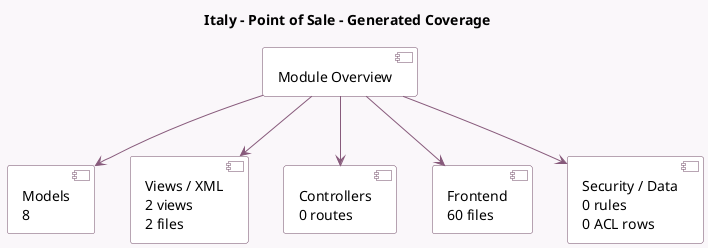

<!-- GENERATED:MODULE -->
---
tags: [odoo, enterprise, module]
---

# Italy - Point of Sale

- Scope: Enterprise Addons
- Source: enterprise/l10n_it_pos
- Dependencies: [[docs/Community Addons/l10n_it/l10n_it|l10n_it]], [[docs/Community Addons/point_of_sale/point_of_sale|point_of_sale]]

## Generated coverage

- Models: 8
- XML files with UI/data artifacts: 2
- Views: 2
- Actions: 0
- Menus: 0
- Rules (ir.rule): 0
- Access CSV entries: 0
- Controller units: 0
- Frontend asset files: 60

## Module map

## Detail notes

- Models: [[docs/Enterprise Addons/l10n_it_pos/Models|Models]] (8)
- Views and XML: [[docs/Enterprise Addons/l10n_it_pos/Views|Views]] (2 files)
- Frontend: [[docs/Enterprise Addons/l10n_it_pos/Frontend|Frontend]] (60 files)

## Key models

- `account.move`
- `account.tax`
- `ir.http`
- `pos.config`
- `pos.order`
- `pos.order.line`
- `pos.payment.method`
- `res.config.settings`

## Navigation

- [[../Enterprise Addons/Enterprise Addons|Back to scope]]
- [[../../docs/docs|Back to docs]]

<!-- GENERATED:MODULE -->

