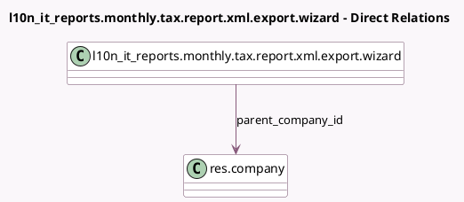

<!-- GENERATED:MODEL -->
---
tags: [odoo, enterprise, generated, model]
---

# l10n_it_reports.monthly.tax.report.xml.export.wizard

- Module: [[docs/Enterprise Addons/l10n_it_reports/l10n_it_reports|l10n_it_reports]]
- Scope: Enterprise Addons
- Defined in module: yes
- Source files: `wizard/monthly_tax_report_xml_export.py`
- Python classes: `L10nItMonthlyTaxReportXmlExportWizard`
- Description: Italian Monthly Tax Report XML Export Wizard

## Field footprint

- Detected fields: 12
- Field types: `Boolean` x 1, `Char` x 6, `Date` x 1, `Many2one` x 1, `Selection` x 3
- Relation fields: 1

## Sample fields

- `commitment_date`: `Date`
- `company_code`: `Char`
- `declarant_fiscal_code`: `Char`
- `declarant_role_code`: `Selection`
- `id_sistema`: `Char`
- `intermediary_code`: `Char`
- `method`: `Selection`
- `parent_company_id`: `Many2one` (comodel `res.company`)
- `parent_company_vat_number`: `Char`
- `show_method`: `Boolean` (compute `_compute_show_method`)
- `submission_commitment`: `Selection`
- `taxpayer_code`: `Char`

## Method hints

- Detected methods: 4
- Action methods: `action_generate_export`
- Compute methods: `_compute_show_method`
- Onchange methods: none

## Direct relation diagram

## Navigation

- **Parent:** [[docs/Enterprise Addons/l10n_it_reports/Models]]

<!-- GENERATED:MODEL -->
