<!-- GENERATED:MODEL -->
---
tags: [odoo, enterprise, generated, model]
---

# account.move

- Module: [[docs/Enterprise Addons/l10n_ke_edi_oscu/l10n_ke_edi_oscu|l10n_ke_edi_oscu]]
- Scope: Enterprise Addons
- Defined in module: extension only
- Source files: `models/account_move.py`
- Python classes: `AccountMove`

## Field footprint

- Detected fields: 11
- Field types: `Binary` x 1, `Char` x 3, `Datetime` x 2, `Integer` x 2, `Json` x 1, `Many2one` x 2
- Relation fields: 2

## Sample fields

- `l10n_ke_control_unit`: `Char`
- `l10n_ke_oscu_attachment_file`: `Binary`
- `l10n_ke_oscu_confirmation_datetime`: `Datetime`
- `l10n_ke_oscu_datetime`: `Datetime`
- `l10n_ke_oscu_internal_data`: `Char`
- `l10n_ke_oscu_invoice_number`: `Integer`
- `l10n_ke_oscu_receipt_number`: `Integer`
- `l10n_ke_oscu_signature`: `Char`
- `l10n_ke_payment_method_id`: `Many2one` (comodel `l10n_ke_edi_oscu.code`)
- `l10n_ke_reason_code_id`: `Many2one` (comodel `l10n_ke_edi_oscu.code`)
- `l10n_ke_validation_message`: `Json` (compute `_compute_l10n_ke_validation_message`)

## Method hints

- Detected methods: 25
- Action methods: `action_l10n_ke_oscu_confirm_vendor_bill`
- Compute methods: `_compute_l10n_ke_validation_message`, `_compute_show_reset_to_draft_button`, `_compute_tax_totals`
- Onchange methods: none

## Direct relation diagram

```plantuml
@startuml
!define ODOO_COLOR_PRIMARY #714B67
!define ODOO_COLOR_ACCENT #875A7B
!define ODOO_COLOR_BG #FAF7FA

skinparam backgroundColor ODOO_COLOR_BG
skinparam defaultTextAlignment left
skinparam ArrowColor ODOO_COLOR_ACCENT
skinparam ClassBackgroundColor white
skinparam ClassBorderColor ODOO_COLOR_PRIMARY
skinparam ComponentBackgroundColor white
skinparam ComponentBorderColor ODOO_COLOR_PRIMARY
skinparam NoteBackgroundColor #FFF8FF
skinparam NoteBorderColor ODOO_COLOR_ACCENT
skinparam SequenceLifeLineBorderColor ODOO_COLOR_ACCENT
skinparam SequenceLifeLineBackgroundColor #FFFFFF
skinparam SequenceParticipantBorderColor ODOO_COLOR_PRIMARY
skinparam SequenceParticipantBackgroundColor #FFFFFF
skinparam sequence {
  ArrowColor ODOO_COLOR_ACCENT
  ActorBorderColor ODOO_COLOR_PRIMARY
}
title account.move - Direct Relations
class "account.move" as account_move
class "l10n_ke_edi_oscu.code" as l10n_ke_edi_oscu_code
account_move --> l10n_ke_edi_oscu_code : l10n_ke_payment_method_id
account_move --> l10n_ke_edi_oscu_code : l10n_ke_reason_code_id
@enduml
```

## Navigation

- **Parent:** [[docs/Enterprise Addons/l10n_ke_edi_oscu/Models]]

<!-- GENERATED:MODEL -->
