<!-- GENERATED:MODEL -->
---
tags: [odoo, enterprise, generated, model]
---

# product.template

- Module: [[docs/Enterprise Addons/l10n_ke_edi_oscu/l10n_ke_edi_oscu|l10n_ke_edi_oscu]]
- Scope: Enterprise Addons
- Defined in module: extension only
- Source files: `models/product.py`
- Python classes: `ProductTemplate`

## Field footprint

- Detected fields: 6
- Field types: `Boolean` x 1, `Char` x 1, `Float` x 1, `Many2one` x 2, `Selection` x 1
- Relation fields: 2

## Sample fields

- `l10n_ke_is_insurance_applicable`: `Boolean` (compute `_compute_l10n_ke_is_insurance_applicable`)
- `l10n_ke_item_code`: `Char` (compute `_compute_l10n_ke_item_code`)
- `l10n_ke_origin_country_id`: `Many2one` (comodel `res.country`, compute `_compute_l10n_ke_origin_country_id`)
- `l10n_ke_packaging_quantity`: `Float` (compute `_compute_l10n_ke_packaging_quantity`)
- `l10n_ke_packaging_unit_id`: `Many2one` (comodel `l10n_ke_edi_oscu.code`, compute `_compute_l10n_ke_packaging_unit_id`)
- `l10n_ke_product_type_code`: `Selection` (compute `_compute_l10n_ke_product_type_code`)

## Method hints

- Detected methods: 16
- Action methods: `action_l10n_ke_oscu_save_item`, `action_l10n_ke_oscu_save_stock_master`
- Compute methods: `_compute_l10n_ke_is_insurance_applicable`, `_compute_l10n_ke_item_code`, `_compute_l10n_ke_origin_country_id`, `_compute_l10n_ke_packaging_quantity`, `_compute_l10n_ke_packaging_unit_id`, `_compute_l10n_ke_product_type_code`
- Onchange methods: none

## Direct relation diagram

```plantuml
@startuml
!define ODOO_COLOR_PRIMARY #714B67
!define ODOO_COLOR_ACCENT #875A7B
!define ODOO_COLOR_BG #FAF7FA

skinparam backgroundColor ODOO_COLOR_BG
skinparam defaultTextAlignment left
skinparam ArrowColor ODOO_COLOR_ACCENT
skinparam ClassBackgroundColor white
skinparam ClassBorderColor ODOO_COLOR_PRIMARY
skinparam ComponentBackgroundColor white
skinparam ComponentBorderColor ODOO_COLOR_PRIMARY
skinparam NoteBackgroundColor #FFF8FF
skinparam NoteBorderColor ODOO_COLOR_ACCENT
skinparam SequenceLifeLineBorderColor ODOO_COLOR_ACCENT
skinparam SequenceLifeLineBackgroundColor #FFFFFF
skinparam SequenceParticipantBorderColor ODOO_COLOR_PRIMARY
skinparam SequenceParticipantBackgroundColor #FFFFFF
skinparam sequence {
  ArrowColor ODOO_COLOR_ACCENT
  ActorBorderColor ODOO_COLOR_PRIMARY
}
title product.template - Direct Relations
class "product.template" as product_template
class "l10n_ke_edi_oscu.code" as l10n_ke_edi_oscu_code
class "res.country" as res_country
product_template --> l10n_ke_edi_oscu_code : l10n_ke_packaging_unit_id
product_template --> res_country : l10n_ke_origin_country_id
@enduml
```

## Navigation

- **Parent:** [[docs/Enterprise Addons/l10n_ke_edi_oscu/Models]]

<!-- GENERATED:MODEL -->
