<!-- GENERATED:MODEL -->
---
tags: [odoo, enterprise, generated, model]
---

# res.users

- Module: [[docs/Enterprise Addons/l10n_ke_edi_oscu/l10n_ke_edi_oscu|l10n_ke_edi_oscu]]
- Scope: Enterprise Addons
- Defined in module: extension only
- Source files: `models/res_users.py`
- Python classes: `ResUsers`

## Field footprint

- Detected fields: 1
- Field types: `One2many` x 1
- Relation fields: 1

## Sample fields

- `l10n_ke_oscu_company_ids`: `One2many` (comodel `res.company`, compute `_compute_l10n_ke_oscu_company_ids`)

## Method hints

- Detected methods: 2
- Action methods: `action_l10n_ke_create_branch_user`
- Compute methods: `_compute_l10n_ke_oscu_company_ids`
- Onchange methods: none

## Direct relation diagram

```plantuml
@startuml
!define ODOO_COLOR_PRIMARY #714B67
!define ODOO_COLOR_ACCENT #875A7B
!define ODOO_COLOR_BG #FAF7FA

skinparam backgroundColor ODOO_COLOR_BG
skinparam defaultTextAlignment left
skinparam ArrowColor ODOO_COLOR_ACCENT
skinparam ClassBackgroundColor white
skinparam ClassBorderColor ODOO_COLOR_PRIMARY
skinparam ComponentBackgroundColor white
skinparam ComponentBorderColor ODOO_COLOR_PRIMARY
skinparam NoteBackgroundColor #FFF8FF
skinparam NoteBorderColor ODOO_COLOR_ACCENT
skinparam SequenceLifeLineBorderColor ODOO_COLOR_ACCENT
skinparam SequenceLifeLineBackgroundColor #FFFFFF
skinparam SequenceParticipantBorderColor ODOO_COLOR_PRIMARY
skinparam SequenceParticipantBackgroundColor #FFFFFF
skinparam sequence {
  ArrowColor ODOO_COLOR_ACCENT
  ActorBorderColor ODOO_COLOR_PRIMARY
}
title res.users - Direct Relations
class "res.users" as res_users
class "res.company" as res_company
res_users --|> res_company : l10n_ke_oscu_company_ids
@enduml
```

## Navigation

- **Parent:** [[docs/Enterprise Addons/l10n_ke_edi_oscu/Models]]

<!-- GENERATED:MODEL -->
