<!-- GENERATED:MODEL -->
---
tags: [odoo, enterprise, generated, model]
---

# pos.order

- Module: [[docs/Enterprise Addons/l10n_ke_edi_oscu_pos/l10n_ke_edi_oscu_pos|l10n_ke_edi_oscu_pos]]
- Scope: Enterprise Addons
- Defined in module: extension only
- Source files: `models/pos_order.py`
- Python classes: `PosOrder`

## Field footprint

- Detected fields: 10
- Field types: `Char` x 3, `Datetime` x 2, `Integer` x 2, `Json` x 1, `Many2one` x 1, `Selection` x 1
- Relation fields: 1

## Sample fields

- `l10n_ke_control_unit`: `Char`
- `l10n_ke_order_json`: `Json`
- `l10n_ke_order_send_status`: `Selection` (compute `_compute_send_status`, store `True`)
- `l10n_ke_oscu_confirmation_datetime`: `Datetime`
- `l10n_ke_oscu_datetime`: `Datetime`
- `l10n_ke_oscu_internal_data`: `Char`
- `l10n_ke_oscu_order_number`: `Integer`
- `l10n_ke_oscu_receipt_number`: `Integer`
- `l10n_ke_oscu_signature`: `Char`
- `l10n_ke_payment_method_id`: `Many2one` (comodel `l10n_ke_edi_oscu.code`)

## Method hints

- Detected methods: 13
- Action methods: `action_post_order`, `action_post_selected_orders`
- Compute methods: `_compute_send_status`
- Onchange methods: none

## Direct relation diagram

```plantuml
@startuml
!define ODOO_COLOR_PRIMARY #714B67
!define ODOO_COLOR_ACCENT #875A7B
!define ODOO_COLOR_BG #FAF7FA

skinparam backgroundColor ODOO_COLOR_BG
skinparam defaultTextAlignment left
skinparam ArrowColor ODOO_COLOR_ACCENT
skinparam ClassBackgroundColor white
skinparam ClassBorderColor ODOO_COLOR_PRIMARY
skinparam ComponentBackgroundColor white
skinparam ComponentBorderColor ODOO_COLOR_PRIMARY
skinparam NoteBackgroundColor #FFF8FF
skinparam NoteBorderColor ODOO_COLOR_ACCENT
skinparam SequenceLifeLineBorderColor ODOO_COLOR_ACCENT
skinparam SequenceLifeLineBackgroundColor #FFFFFF
skinparam SequenceParticipantBorderColor ODOO_COLOR_PRIMARY
skinparam SequenceParticipantBackgroundColor #FFFFFF
skinparam sequence {
  ArrowColor ODOO_COLOR_ACCENT
  ActorBorderColor ODOO_COLOR_PRIMARY
}
title pos.order - Direct Relations
class "pos.order" as pos_order
class "l10n_ke_edi_oscu.code" as l10n_ke_edi_oscu_code
pos_order --> l10n_ke_edi_oscu_code : l10n_ke_payment_method_id
@enduml
```

## Navigation

- **Parent:** [[docs/Enterprise Addons/l10n_ke_edi_oscu_pos/Models]]

<!-- GENERATED:MODEL -->
