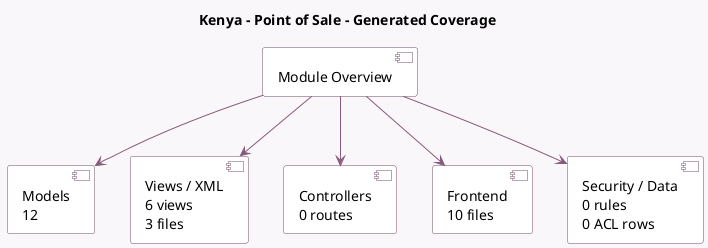

<!-- GENERATED:MODULE -->
---
tags: [odoo, enterprise, module]
---

# Kenya - Point of Sale

- Scope: Enterprise Addons
- Source: enterprise/l10n_ke_edi_oscu_pos
- Dependencies: [[docs/Enterprise Addons/l10n_ke_edi_oscu_stock/l10n_ke_edi_oscu_stock|l10n_ke_edi_oscu_stock]], [[docs/Community Addons/point_of_sale/point_of_sale|point_of_sale]]

## Generated coverage

- Models: 12
- XML files with UI/data artifacts: 3
- Views: 6
- Actions: 0
- Menus: 0
- Rules (ir.rule): 0
- Access CSV entries: 0
- Controller units: 0
- Frontend asset files: 10

## Module map

## Detail notes

- Models: [[docs/Enterprise Addons/l10n_ke_edi_oscu_pos/Models|Models]] (12)
- Views and XML: [[docs/Enterprise Addons/l10n_ke_edi_oscu_pos/Views|Views]] (3 files)
- Frontend: [[docs/Enterprise Addons/l10n_ke_edi_oscu_pos/Frontend|Frontend]] (10 files)

## Key models

- `account.chart.template`
- `account.move`
- `account.move.send`
- `l10n_ke_edi_oscu.code`
- `pos.config`
- `pos.order`
- `pos.session`
- `product.product`
- `product.template`
- `product.unspsc.code`
- `stock.move`
- `stock.picking`

## Navigation

- [[../Enterprise Addons/Enterprise Addons|Back to scope]]
- [[../../docs/docs|Back to docs]]

<!-- GENERATED:MODULE -->

