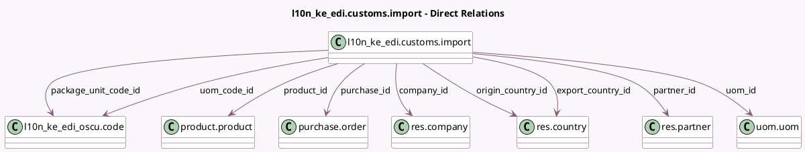

<!-- GENERATED:MODEL -->
---
tags: [odoo, enterprise, generated, model]
---

# l10n_ke_edi.customs.import

- Module: [[docs/Enterprise Addons/l10n_ke_edi_oscu_stock/l10n_ke_edi_oscu_stock|l10n_ke_edi_oscu_stock]]
- Scope: Enterprise Addons
- Defined in module: yes
- Source files: `models/l10n_ke_edi_customs_import.py`
- Python classes: `L10n_Ke_EdiCustomsImport`
- Description: Kenya Customs Import
- Inherits: `mail.thread`

## Field footprint

- Detected fields: 21
- Field types: `Char` x 5, `Date` x 1, `Float` x 1, `Integer` x 2, `Json` x 1, `Many2one` x 9, `Selection` x 1, `Text` x 1
- Relation fields: 9

## Sample fields

- `company_id`: `Many2one` (comodel `res.company`)
- `declaration_date`: `Date` (comodel `Declaration Date`)
- `declaration_number`: `Char` (comodel `Declaration Number`)
- `export_country_id`: `Many2one` (comodel `res.country`)
- `hs_code`: `Char` (comodel `HS Code`)
- `item_name`: `Char` (comodel `Item Name`)
- `item_seq`: `Integer` (comodel `Item Sequence`)
- `number_packages`: `Integer` (comodel `Number of Packages`)
- `origin_country_id`: `Many2one` (comodel `res.country`)
- `package_unit_code_id`: `Many2one` (comodel `l10n_ke_edi_oscu.code`)
- `partner_id`: `Many2one` (comodel `res.partner`)
- `product_id`: `Many2one` (comodel `product.product`)
- `purchase_id`: `Many2one` (comodel `purchase.order`)
- `quantity`: `Float` (comodel `Quantity`)
- `remark`: `Text` (comodel `Remark`)
- `state`: `Selection`
- `supplier_name`: `Char` (comodel `Vendor`)
- `task_code`: `Char` (comodel `Task Code`)
- `uom_code_id`: `Many2one` (comodel `l10n_ke_edi_oscu.code`)
- `uom_id`: `Many2one` (comodel `uom.uom`, compute `_compute_uom_id`)

## Method hints

- Detected methods: 11
- Action methods: `action_create_purchase_order`, `action_view_purchase_order`
- Compute methods: `_compute_uom_id`, `_compute_warning_msg`
- Onchange methods: none

## Direct relation diagram

## Navigation

- **Parent:** [[docs/Enterprise Addons/l10n_ke_edi_oscu_stock/Models]]

<!-- GENERATED:MODEL -->
