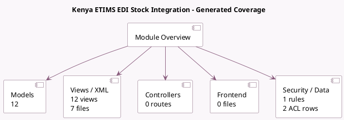

<!-- GENERATED:MODULE -->
---
tags: [odoo, enterprise, module]
---

# Kenya ETIMS EDI Stock Integration

- Scope: Enterprise Addons
- Source: enterprise/l10n_ke_edi_oscu_stock
- Dependencies: [[docs/Enterprise Addons/l10n_ke_edi_oscu/l10n_ke_edi_oscu|l10n_ke_edi_oscu]], [[docs/Community Addons/sale_management/sale_management|sale_management]], [[docs/Community Addons/purchase_stock/purchase_stock|purchase_stock]], [[docs/Community Addons/sale_stock/sale_stock|sale_stock]]

## Summary

            Kenya eTIMS Device EDI Stock Integration
        

## Generated coverage

- Models: 12
- XML files with UI/data artifacts: 7
- Views: 12
- Actions: 2
- Menus: 1
- Rules (ir.rule): 1
- Access CSV entries: 2
- Controller units: 0
- Frontend asset files: 0

## Module map

## Detail notes

- Models: [[docs/Enterprise Addons/l10n_ke_edi_oscu_stock/Models|Models]] (12)
- Views and XML: [[docs/Enterprise Addons/l10n_ke_edi_oscu_stock/Views|Views]] (7 files)

## Key models

- `account.move`
- `account.move.line`
- `l10n_ke_edi.customs.import`
- `product.product`
- `product.template`
- `purchase.order`
- `purchase.order.line`
- `res.company`
- `stock.move`
- `stock.picking`
- `stock.quant`
- `stock.return.picking`

## Navigation

- [[../Enterprise Addons/Enterprise Addons|Back to scope]]
- [[../../docs/docs|Back to docs]]

<!-- GENERATED:MODULE -->

