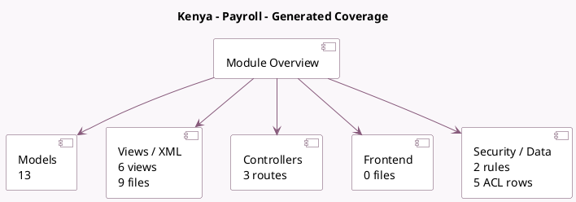

<!-- GENERATED:MODULE -->
---
tags: [odoo, enterprise, module]
---

# Kenya - Payroll

- Scope: Enterprise Addons
- Source: enterprise/l10n_ke_hr_payroll
- Dependencies: [[docs/Enterprise Addons/hr_payroll/hr_payroll|hr_payroll]], [[docs/Community Addons/hr_work_entry_holidays/hr_work_entry_holidays|hr_work_entry_holidays]], [[docs/Enterprise Addons/hr_payroll_holidays/hr_payroll_holidays|hr_payroll_holidays]]

## Generated coverage

- Models: 13
- XML files with UI/data artifacts: 9
- Views: 6
- Actions: 6
- Menus: 4
- Rules (ir.rule): 2
- Access CSV entries: 5
- Controller units: 1
- Frontend asset files: 0

## Module map

## Detail notes

- Models: [[docs/Enterprise Addons/l10n_ke_hr_payroll/Models|Models]] (13)
- Views and XML: [[docs/Enterprise Addons/l10n_ke_hr_payroll/Views|Views]] (9 files)
- Controllers: [[docs/Enterprise Addons/l10n_ke_hr_payroll/Controllers|Controllers]] (1)

## Key models

- `hr.employee`
- `hr.payroll.structure.type`
- `hr.payslip`
- `hr.payslip.line`
- `hr.version`
- `ir.ui.menu`
- `l10n.ke.hr.payroll.nssf.report.line.wizard`
- `l10n.ke.hr.payroll.nssf.report.wizard`
- `l10n.ke.hr.payroll.shif.report.line.wizard`
- `l10n.ke.hr.payroll.shif.report.wizard`
- `l10n_ke.tax.deduction.card`
- `report.l10n_ke_hr_payroll.report_tax_deduction_card`

## Navigation

- [[../Enterprise Addons/Enterprise Addons|Back to scope]]
- [[../../docs/docs|Back to docs]]

<!-- GENERATED:MODULE -->

