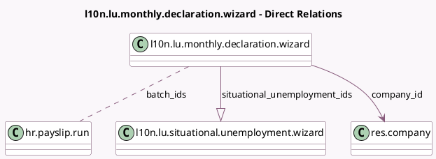

<!-- GENERATED:MODEL -->
---
tags: [odoo, enterprise, generated, model]
---

# l10n.lu.monthly.declaration.wizard

- Module: [[docs/Enterprise Addons/l10n_lu_hr_payroll/l10n_lu_hr_payroll|l10n_lu_hr_payroll]]
- Scope: Enterprise Addons
- Defined in module: yes
- Source files: `wizard/l10n_lu_monthly_declaration_wizard.py`
- Python classes: `L10nLuMonthlyDeclarationWizard`
- Description: Luxembourg: Monthly Declaration

## Field footprint

- Detected fields: 10
- Field types: `Binary` x 1, `Boolean` x 1, `Char` x 1, `Date` x 2, `Many2many` x 1, `Many2one` x 1, `One2many` x 1, `Selection` x 2
- Relation fields: 3

## Sample fields

- `batch_ids`: `Many2many` (comodel `hr.payslip.run`, compute `_compute_batch_ids`)
- `can_generate`: `Boolean` (compute `_compute_can_generate`)
- `company_id`: `Many2one` (comodel `res.company`)
- `date_end`: `Date` (compute `_compute_dates`)
- `date_start`: `Date` (compute `_compute_dates`)
- `decsal_file`: `Binary`
- `decsal_name`: `Char` (store `False`)
- `month`: `Selection`
- `situational_unemployment_ids`: `One2many` (comodel `l10n.lu.situational.unemployment.wizard`, compute `_compute_situational_unemployment_ids`, store `True`)
- `year`: `Selection`

## Method hints

- Detected methods: 9
- Action methods: `action_generate_declaration`
- Compute methods: `_compute_batch_ids`, `_compute_can_generate`, `_compute_dates`, `_compute_situational_unemployment_ids`
- Onchange methods: none

## Direct relation diagram

## Navigation

- **Parent:** [[docs/Enterprise Addons/l10n_lu_hr_payroll/Models]]

<!-- GENERATED:MODEL -->
