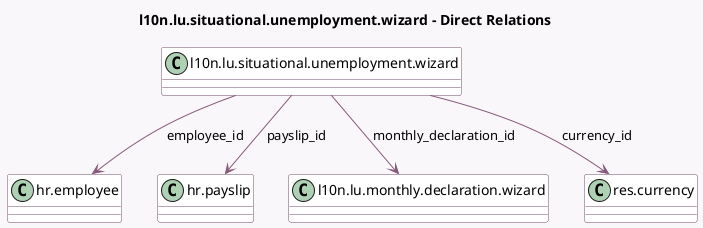

<!-- GENERATED:MODEL -->
---
tags: [odoo, enterprise, generated, model]
---

# l10n.lu.situational.unemployment.wizard

- Module: [[docs/Enterprise Addons/l10n_lu_hr_payroll/l10n_lu_hr_payroll|l10n_lu_hr_payroll]]
- Scope: Enterprise Addons
- Defined in module: yes
- Source files: `wizard/l10n_lu_monthly_declaration_wizard.py`
- Python classes: `L10nLuSituationalUnemploymentWizard`
- Description: Employee Situational Unemployment

## Field footprint

- Detected fields: 7
- Field types: `Float` x 1, `Many2one` x 5, `Monetary` x 1
- Relation fields: 5

## Sample fields

- `amount`: `Monetary`
- `company_id`: `Many2one` (related `monthly_declaration_id.company_id`)
- `currency_id`: `Many2one` (comodel `res.currency`, related `company_id.currency_id`)
- `employee_id`: `Many2one` (comodel `hr.employee`)
- `hours`: `Float`
- `monthly_declaration_id`: `Many2one` (comodel `l10n.lu.monthly.declaration.wizard`)
- `payslip_id`: `Many2one` (comodel `hr.payslip`)

## Method hints

- Detected methods: 0
- Action methods: none
- Compute methods: none
- Onchange methods: none

## Direct relation diagram

## Navigation

- **Parent:** [[docs/Enterprise Addons/l10n_lu_hr_payroll/Models]]

<!-- GENERATED:MODEL -->
