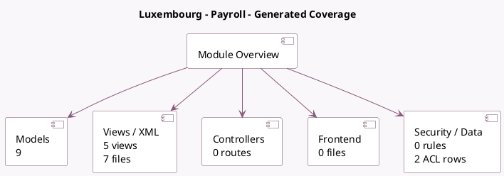

<!-- GENERATED:MODULE -->
---
tags: [odoo, enterprise, module]
---

# Luxembourg - Payroll

- Scope: Enterprise Addons
- Source: enterprise/l10n_lu_hr_payroll
- Dependencies: [[docs/Enterprise Addons/hr_payroll/hr_payroll|hr_payroll]], [[docs/Community Addons/hr_work_entry_holidays/hr_work_entry_holidays|hr_work_entry_holidays]], [[docs/Enterprise Addons/hr_payroll_holidays/hr_payroll_holidays|hr_payroll_holidays]]

## Generated coverage

- Models: 9
- XML files with UI/data artifacts: 7
- Views: 5
- Actions: 3
- Menus: 2
- Rules (ir.rule): 0
- Access CSV entries: 2
- Controller units: 0
- Frontend asset files: 0

## Module map

## Detail notes

- Models: [[docs/Enterprise Addons/l10n_lu_hr_payroll/Models|Models]] (9)
- Views and XML: [[docs/Enterprise Addons/l10n_lu_hr_payroll/Views|Views]] (7 files)

## Key models

- `hr.employee`
- `hr.payroll.structure.type`
- `hr.payslip`
- `hr.payslip.worked_days`
- `hr.version`
- `l10n.lu.monthly.declaration.wizard`
- `l10n.lu.situational.unemployment.wizard`
- `res.company`
- `res.config.settings`

## Navigation

- [[../Enterprise Addons/Enterprise Addons|Back to scope]]
- [[../../docs/docs|Back to docs]]

<!-- GENERATED:MODULE -->

