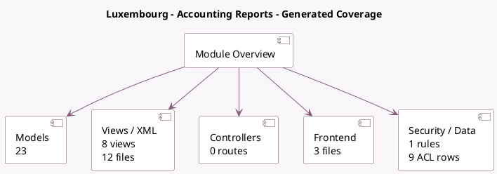

<!-- GENERATED:MODULE -->
---
tags: [odoo, enterprise, module]
---

# Luxembourg - Accounting Reports

- Scope: Enterprise Addons
- Source: enterprise/l10n_lu_reports
- Dependencies: [[docs/Community Addons/l10n_lu/l10n_lu|l10n_lu]], [[docs/Enterprise Addons/account_asset/account_asset|account_asset]], [[docs/Enterprise Addons/account_reports/account_reports|account_reports]], [[docs/Enterprise Addons/account_saft/account_saft|account_saft]]

## Generated coverage

- Models: 23
- XML files with UI/data artifacts: 12
- Views: 8
- Actions: 5
- Menus: 2
- Rules (ir.rule): 1
- Access CSV entries: 9
- Controller units: 0
- Frontend asset files: 3

## Module map

## Detail notes

- Models: [[docs/Enterprise Addons/l10n_lu_reports/Models|Models]] (23)
- Views and XML: [[docs/Enterprise Addons/l10n_lu_reports/Views|Views]] (12 files)
- Frontend: [[docs/Enterprise Addons/l10n_lu_reports/Frontend|Frontend]] (3 files)

## Key models

- `account.chart.template`
- `account.general.ledger.report.handler`
- `account.report`
- `account.return`
- `account.return.type`
- `ir.attachment`
- `l10n_lu.annual.tax.report.handler`
- `l10n_lu.appendix.a.tax.report.handler`
- `l10n_lu.appendix.opex.tax.report.handler`
- `l10n_lu.ec.sales.report.handler`
- `l10n_lu.generate.accounts.report`
- `l10n_lu.generate.asset.report`

## Navigation

- [[../Enterprise Addons/Enterprise Addons|Back to scope]]
- [[../../docs/docs|Back to docs]]

<!-- GENERATED:MODULE -->

