<!-- GENERATED:MODEL -->
---
tags: [odoo, enterprise, generated, model]
---

# account.move

- Module: [[docs/Enterprise Addons/l10n_mx_edi/l10n_mx_edi|l10n_mx_edi]]
- Scope: Enterprise Addons
- Defined in module: extension only
- Source files: `models/account_move.py`
- Python classes: `AccountMove`

## Field footprint

- Detected fields: 25
- Field types: `Boolean` x 5, `Char` x 5, `Datetime` x 1, `Many2many` x 2, `Many2one` x 4, `Monetary` x 1, `One2many` x 2, `Selection` x 5
- Relation fields: 8

## Sample fields

- `l10n_mx_edi_addenda_ids`: `Many2many` (comodel `l10n_mx_edi.addenda`, compute `_compute_l10n_mx_edi_addenda_ids`, store `True`)
- `l10n_mx_edi_cer_source`: `Char`
- `l10n_mx_edi_certificate_id`: `Many2one` (comodel `certificate.certificate`)
- `l10n_mx_edi_cfdi_amount`: `Monetary` (compute `_compute_cfdi_values`)
- `l10n_mx_edi_cfdi_attachment_id`: `Many2one` (comodel `ir.attachment`, compute `_compute_l10n_mx_edi_cfdi_state_and_attachment`, store `True`)
- `l10n_mx_edi_cfdi_cancel_id`: `Many2one` (comodel `account.move`, compute `_compute_l10n_mx_edi_cfdi_cancel_id`)
- `l10n_mx_edi_cfdi_customer_rfc`: `Char` (compute `_compute_cfdi_values`)
- `l10n_mx_edi_cfdi_origin`: `Char`
- `l10n_mx_edi_cfdi_sat_state`: `Selection` (compute `_compute_l10n_mx_edi_cfdi_state_and_attachment`, store `True`)
- `l10n_mx_edi_cfdi_state`: `Selection` (compute `_compute_l10n_mx_edi_cfdi_state_and_attachment`, store `True`)
- `l10n_mx_edi_cfdi_supplier_rfc`: `Char` (compute `_compute_cfdi_values`)
- `l10n_mx_edi_cfdi_to_public`: `Boolean` (compute `_compute_l10n_mx_edi_cfdi_to_public`, store `True`)
- `l10n_mx_edi_cfdi_uuid`: `Char` (compute `_compute_l10n_mx_edi_cfdi_uuid`, store `True`)
- `l10n_mx_edi_document_ids`: `One2many` (comodel `l10n_mx_edi.document`, compute `_compute_l10n_mx_edi_document_ids`)
- `l10n_mx_edi_force_pue_payment_needed`: `Boolean` (compute `_compute_l10n_mx_edi_force_pue_payment_needed`)
- `l10n_mx_edi_invoice_cancellation_reason`: `Selection` (compute `_compute_l10n_mx_edi_cfdi_state_and_attachment`, store `True`)
- `l10n_mx_edi_invoice_document_ids`: `Many2many` (comodel `l10n_mx_edi.document`)
- `l10n_mx_edi_is_cfdi_needed`: `Boolean` (compute `_compute_l10n_mx_edi_is_cfdi_needed`, store `True`)
- `l10n_mx_edi_payment_document_ids`: `One2many` (comodel `l10n_mx_edi.document`)
- `l10n_mx_edi_payment_method_id`: `Many2one` (comodel `l10n_mx_edi.payment.method`, compute `_compute_l10n_mx_edi_payment_method_id`, store `True`)

## Method hints

- Detected methods: 101
- Action methods: `action_invoice_download_cfdi`
- Compute methods: `_compute_amount_total_words`, `_compute_cfdi_values`, `_compute_duplicated_ref_ids`, `_compute_l10n_mx_edi_addenda_ids`, `_compute_l10n_mx_edi_cfdi_cancel_id`, `_compute_l10n_mx_edi_cfdi_state_and_attachment`, `_compute_l10n_mx_edi_cfdi_to_public`, `_compute_l10n_mx_edi_cfdi_uuid`, and 10 more
- Onchange methods: none

## Direct relation diagram

```plantuml
@startuml
!define ODOO_COLOR_PRIMARY #714B67
!define ODOO_COLOR_ACCENT #875A7B
!define ODOO_COLOR_BG #FAF7FA

skinparam backgroundColor ODOO_COLOR_BG
skinparam defaultTextAlignment left
skinparam ArrowColor ODOO_COLOR_ACCENT
skinparam ClassBackgroundColor white
skinparam ClassBorderColor ODOO_COLOR_PRIMARY
skinparam ComponentBackgroundColor white
skinparam ComponentBorderColor ODOO_COLOR_PRIMARY
skinparam NoteBackgroundColor #FFF8FF
skinparam NoteBorderColor ODOO_COLOR_ACCENT
skinparam SequenceLifeLineBorderColor ODOO_COLOR_ACCENT
skinparam SequenceLifeLineBackgroundColor #FFFFFF
skinparam SequenceParticipantBorderColor ODOO_COLOR_PRIMARY
skinparam SequenceParticipantBackgroundColor #FFFFFF
skinparam sequence {
  ArrowColor ODOO_COLOR_ACCENT
  ActorBorderColor ODOO_COLOR_PRIMARY
}
title account.move - Direct Relations
class "account.move" as account_move
class "account.move" as account_move
class "certificate.certificate" as certificate_certificate
class "ir.attachment" as ir_attachment
class "l10n_mx_edi.addenda" as l10n_mx_edi_addenda
class "l10n_mx_edi.document" as l10n_mx_edi_document
class "l10n_mx_edi.payment.method" as l10n_mx_edi_payment_method
account_move .. l10n_mx_edi_document : l10n_mx_edi_invoice_document_ids
account_move --|> l10n_mx_edi_document : l10n_mx_edi_payment_document_ids
account_move --|> l10n_mx_edi_document : l10n_mx_edi_document_ids
account_move --> ir_attachment : l10n_mx_edi_cfdi_attachment_id
account_move --> account_move : l10n_mx_edi_cfdi_cancel_id
account_move --> certificate_certificate : l10n_mx_edi_certificate_id
account_move --> l10n_mx_edi_payment_method : l10n_mx_edi_payment_method_id
account_move .. l10n_mx_edi_addenda : l10n_mx_edi_addenda_ids
@enduml
```

## Navigation

- **Parent:** [[docs/Enterprise Addons/l10n_mx_edi/Models]]

<!-- GENERATED:MODEL -->
