<!-- GENERATED:MODEL -->
---
tags: [odoo, enterprise, generated, model]
---

# account.payment

- Module: [[docs/Enterprise Addons/l10n_mx_edi/l10n_mx_edi|l10n_mx_edi]]
- Scope: Enterprise Addons
- Defined in module: extension only
- Source files: `models/account_payment.py`
- Python classes: `AccountPayment`

## Field footprint

- Detected fields: 11
- Field types: `Boolean` x 3, `Char` x 2, `Many2one` x 3, `One2many` x 1, `Selection` x 2
- Relation fields: 4

## Sample fields

- `l10n_mx_edi_cfdi_attachment_id`: `Many2one` (related `move_id.l10n_mx_edi_cfdi_attachment_id`)
- `l10n_mx_edi_cfdi_cancel_id`: `Many2one` (related `move_id.l10n_mx_edi_cfdi_cancel_id`)
- `l10n_mx_edi_cfdi_origin`: `Char` (related `move_id.l10n_mx_edi_cfdi_origin`)
- `l10n_mx_edi_cfdi_sat_state`: `Selection` (related `move_id.l10n_mx_edi_cfdi_sat_state`)
- `l10n_mx_edi_cfdi_state`: `Selection` (related `move_id.l10n_mx_edi_cfdi_state`)
- `l10n_mx_edi_cfdi_uuid`: `Char` (related `move_id.l10n_mx_edi_cfdi_uuid`)
- `l10n_mx_edi_force_pue_payment_needed`: `Boolean` (related `move_id.l10n_mx_edi_force_pue_payment_needed`)
- `l10n_mx_edi_is_cfdi_needed`: `Boolean` (related `move_id.l10n_mx_edi_is_cfdi_needed`)
- `l10n_mx_edi_payment_document_ids`: `One2many` (related `move_id.l10n_mx_edi_payment_document_ids`)
- `l10n_mx_edi_payment_method_id`: `Many2one` (related `move_id.l10n_mx_edi_payment_method_id`)
- `l10n_mx_edi_update_sat_needed`: `Boolean` (related `move_id.l10n_mx_edi_update_sat_needed`)

## Method hints

- Detected methods: 4
- Action methods: none
- Compute methods: none
- Onchange methods: none

## Direct relation diagram

```plantuml
@startuml
!define ODOO_COLOR_PRIMARY #714B67
!define ODOO_COLOR_ACCENT #875A7B
!define ODOO_COLOR_BG #FAF7FA

skinparam backgroundColor ODOO_COLOR_BG
skinparam defaultTextAlignment left
skinparam ArrowColor ODOO_COLOR_ACCENT
skinparam ClassBackgroundColor white
skinparam ClassBorderColor ODOO_COLOR_PRIMARY
skinparam ComponentBackgroundColor white
skinparam ComponentBorderColor ODOO_COLOR_PRIMARY
skinparam NoteBackgroundColor #FFF8FF
skinparam NoteBorderColor ODOO_COLOR_ACCENT
skinparam SequenceLifeLineBorderColor ODOO_COLOR_ACCENT
skinparam SequenceLifeLineBackgroundColor #FFFFFF
skinparam SequenceParticipantBorderColor ODOO_COLOR_PRIMARY
skinparam SequenceParticipantBackgroundColor #FFFFFF
skinparam sequence {
  ArrowColor ODOO_COLOR_ACCENT
  ActorBorderColor ODOO_COLOR_PRIMARY
}
title account.payment - Direct Relations
class "account.payment" as account_payment
@enduml
```

## Navigation

- **Parent:** [[docs/Enterprise Addons/l10n_mx_edi/Models]]

<!-- GENERATED:MODEL -->
