<!-- GENERATED:MODEL -->
---
tags: [odoo, enterprise, generated, model]
---

# l10n_mx_edi.document

- Module: [[docs/Enterprise Addons/l10n_mx_edi/l10n_mx_edi|l10n_mx_edi]]
- Scope: Enterprise Addons
- Defined in module: yes
- Source files: `models/l10n_mx_edi_document.py`
- Python classes: `L10n_Mx_EdiDocument`
- Description: Mexican documents that needs to transit outside of Odoo

## Field footprint

- Detected fields: 14
- Field types: `Boolean` x 4, `Char` x 3, `Datetime` x 1, `Many2many` x 1, `Many2one` x 2, `Selection` x 3
- Relation fields: 3

## Sample fields

- `attachment_id`: `Many2one` (comodel `ir.attachment`)
- `attachment_origin`: `Char` (compute `_compute_from_attachment`, store `True`)
- `attachment_uuid`: `Char` (compute `_compute_from_attachment`, store `True`)
- `cancel_button_needed`: `Boolean` (compute `_compute_cancel_button_needed`)
- `cancellation_reason`: `Selection`
- `datetime`: `Datetime`
- `invoice_ids`: `Many2many` (comodel `account.move`)
- `message`: `Char`
- `move_id`: `Many2one` (comodel `account.move`)
- `print_button_needed`: `Boolean` (compute `_compute_print_button_needed`)
- `retry_button_needed`: `Boolean` (compute `_compute_retry_button_needed`)
- `sat_state`: `Selection`
- `show_button_needed`: `Boolean` (compute `_compute_show_button_needed`)
- `state`: `Selection`

## Method hints

- Detected methods: 79
- Action methods: `action_cancel`, `action_download_file`, `action_download_payment_receipt`, `action_force_payment_cfdi`, `action_request_cancel`, `action_request_cancel_payment`, `action_retry`, `action_show_document`
- Compute methods: `_compute_cancel_button_needed`, `_compute_from_attachment`, `_compute_print_button_needed`, `_compute_retry_button_needed`, `_compute_show_button_needed`
- Onchange methods: none

## Direct relation diagram

```plantuml
@startuml
!define ODOO_COLOR_PRIMARY #714B67
!define ODOO_COLOR_ACCENT #875A7B
!define ODOO_COLOR_BG #FAF7FA

skinparam backgroundColor ODOO_COLOR_BG
skinparam defaultTextAlignment left
skinparam ArrowColor ODOO_COLOR_ACCENT
skinparam ClassBackgroundColor white
skinparam ClassBorderColor ODOO_COLOR_PRIMARY
skinparam ComponentBackgroundColor white
skinparam ComponentBorderColor ODOO_COLOR_PRIMARY
skinparam NoteBackgroundColor #FFF8FF
skinparam NoteBorderColor ODOO_COLOR_ACCENT
skinparam SequenceLifeLineBorderColor ODOO_COLOR_ACCENT
skinparam SequenceLifeLineBackgroundColor #FFFFFF
skinparam SequenceParticipantBorderColor ODOO_COLOR_PRIMARY
skinparam SequenceParticipantBackgroundColor #FFFFFF
skinparam sequence {
  ArrowColor ODOO_COLOR_ACCENT
  ActorBorderColor ODOO_COLOR_PRIMARY
}
title l10n_mx_edi.document - Direct Relations
class "l10n_mx_edi.document" as l10n_mx_edi_document
class "account.move" as account_move
class "ir.attachment" as ir_attachment
l10n_mx_edi_document .. account_move : invoice_ids
l10n_mx_edi_document --> account_move : move_id
l10n_mx_edi_document --> ir_attachment : attachment_id
@enduml
```

## Navigation

- **Parent:** [[docs/Enterprise Addons/l10n_mx_edi/Models]]

<!-- GENERATED:MODEL -->
