<!-- GENERATED:MODEL -->
---
tags: [odoo, enterprise, generated, model]
---

# l10n_mx_edi.invoice.cancel

- Module: [[docs/Enterprise Addons/l10n_mx_edi/l10n_mx_edi|l10n_mx_edi]]
- Scope: Enterprise Addons
- Defined in module: yes
- Source files: `wizard/l10n_mx_edi_invoice_cancel.py`
- Python classes: `L10n_Mx_EdiInvoiceCancel`
- Description: Request CFDI Cancellation

## Field footprint

- Detected fields: 6
- Field types: `Boolean` x 1, `Char` x 1, `Many2one` x 1, `Selection` x 3
- Relation fields: 1

## Sample fields

- `available_cancellation_reasons`: `Char` (compute `_compute_available_cancellation_reasons`)
- `cancellation_reason`: `Selection` (compute `_compute_cancellation_reason`, store `True`)
- `document_id`: `Many2one` (comodel `l10n_mx_edi.document`)
- `mode`: `Selection` (compute `_compute_mode`, store `True`)
- `need_replacement_invoice_button`: `Boolean` (compute `_compute_need_replacement_invoice_button`)
- `periodicity`: `Selection`

## Method hints

- Detected methods: 6
- Action methods: `action_cancel_invoice`, `action_create_replacement_invoice`
- Compute methods: `_compute_available_cancellation_reasons`, `_compute_cancellation_reason`, `_compute_mode`, `_compute_need_replacement_invoice_button`
- Onchange methods: none

## Direct relation diagram

```plantuml
@startuml
!define ODOO_COLOR_PRIMARY #714B67
!define ODOO_COLOR_ACCENT #875A7B
!define ODOO_COLOR_BG #FAF7FA

skinparam backgroundColor ODOO_COLOR_BG
skinparam defaultTextAlignment left
skinparam ArrowColor ODOO_COLOR_ACCENT
skinparam ClassBackgroundColor white
skinparam ClassBorderColor ODOO_COLOR_PRIMARY
skinparam ComponentBackgroundColor white
skinparam ComponentBorderColor ODOO_COLOR_PRIMARY
skinparam NoteBackgroundColor #FFF8FF
skinparam NoteBorderColor ODOO_COLOR_ACCENT
skinparam SequenceLifeLineBorderColor ODOO_COLOR_ACCENT
skinparam SequenceLifeLineBackgroundColor #FFFFFF
skinparam SequenceParticipantBorderColor ODOO_COLOR_PRIMARY
skinparam SequenceParticipantBackgroundColor #FFFFFF
skinparam sequence {
  ArrowColor ODOO_COLOR_ACCENT
  ActorBorderColor ODOO_COLOR_PRIMARY
}
title l10n_mx_edi.invoice.cancel - Direct Relations
class "l10n_mx_edi.invoice.cancel" as l10n_mx_edi_invoice_cancel
class "l10n_mx_edi.document" as l10n_mx_edi_document
l10n_mx_edi_invoice_cancel --> l10n_mx_edi_document : document_id
@enduml
```

## Navigation

- **Parent:** [[docs/Enterprise Addons/l10n_mx_edi/Models]]

<!-- GENERATED:MODEL -->
