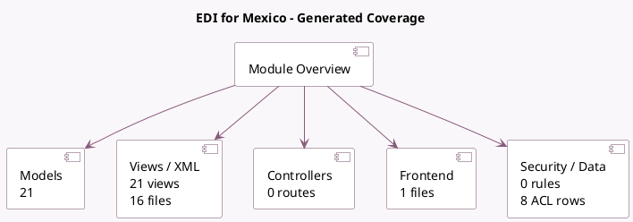

<!-- GENERATED:MODULE -->
---
tags: [odoo, enterprise, module]
---

# EDI for Mexico

- Scope: Enterprise Addons
- Source: enterprise/l10n_mx_edi
- Dependencies: [[docs/Enterprise Addons/account_accountant/account_accountant|account_accountant]], [[docs/Community Addons/l10n_mx/l10n_mx|l10n_mx]], [[docs/Community Addons/base_vat/base_vat|base_vat]], [[docs/Enterprise Addons/product_unspsc/product_unspsc|product_unspsc]], [[docs/Community Addons/certificate/certificate|certificate]]

## Summary

Mexican Localization for EDI documents

## Generated coverage

- Models: 21
- XML files with UI/data artifacts: 16
- Views: 21
- Actions: 4
- Menus: 2
- Rules (ir.rule): 0
- Access CSV entries: 8
- Controller units: 0
- Frontend asset files: 1

## Module map

## Detail notes

- Models: [[docs/Enterprise Addons/l10n_mx_edi/Models|Models]] (21)
- Views and XML: [[docs/Enterprise Addons/l10n_mx_edi/Views|Views]] (16 files)
- Frontend: [[docs/Enterprise Addons/l10n_mx_edi/Frontend|Frontend]] (1 files)

## Key models

- `account.journal`
- `account.move`
- `account.move.line`
- `account.move.reversal`
- `account.move.send`
- `account.payment`
- `account.payment.register`
- `ir.attachment`
- `l10n_mx_edi.addenda`
- `l10n_mx_edi.document`
- `l10n_mx_edi.global_invoice.create`
- `l10n_mx_edi.invoice.cancel`

## Navigation

- [[../Enterprise Addons/Enterprise Addons|Back to scope]]
- [[../../docs/docs|Back to docs]]

<!-- GENERATED:MODULE -->

## Curated analysis

### Functional role
- `l10n_mx_edi` adds Mexican CFDI generation, signing, cancellation, download, and payment complement handling on top of accounting.
- It sits on both compliance and operational accounting, because journals, invoices, payments, addendas, and provider credentials all participate in the workflow.

### Operational footprint
- `account_move.py`, `account_journal.py`, and `l10n_mx_edi_document.py` drive most of the compliance logic, while XML data files load CFDI 4.0 and payment complement templates.
- The module also adds cron work, addenda support, certificate handling, and wizard flows for cancellation and global invoice creation.

### Evidence
- Source files: `enterprise/l10n_mx_edi/models/account_move.py`, `enterprise/l10n_mx_edi/models/account_journal.py`, `enterprise/l10n_mx_edi/models/l10n_mx_edi_document.py`
- Compliance data and views: `enterprise/l10n_mx_edi/data/4.0/cfdi.xml`, `enterprise/l10n_mx_edi/data/ir_cron.xml`, `enterprise/l10n_mx_edi/views/account_move_view.xml`
- Tests: `enterprise/l10n_mx_edi/tests/test_account_move.py`, `enterprise/l10n_mx_edi/tests/test_cfdi_download.py`, `enterprise/l10n_mx_edi/tests/test_cfdi_invoice_documents.py`

### Related notes
- `[[docs/Community Addons/account_edi/account_edi|account_edi]]`
- `[[docs/Community Addons/l10n_mx/l10n_mx|l10n_mx]]`

### Rollout and migration concerns
- PAC credentials, certificates, SAT cancellation rules, and XML templates must be validated before production issuance because failures block legal invoicing, not just an optional integration.
- Cutover plans should include payment complements, public invoices, rounding scenarios, and locked-period cancellation tests, since those are explicitly covered by the module test suite.
- Legacy comparison backlog was retired on 2026-03-02; keep this note focused on the current codebase.

