<!-- GENERATED:MODEL -->
---
tags: [odoo, enterprise, generated, model]
---

# stock.lot

- Module: [[docs/Enterprise Addons/l10n_mx_edi_landing/l10n_mx_edi_landing|l10n_mx_edi_landing]]
- Scope: Enterprise Addons
- Defined in module: extension only
- Source files: `models/stock_lot.py`
- Python classes: `StockLot`

## Field footprint

- Detected fields: 3
- Field types: `Char` x 2, `Many2one` x 1
- Relation fields: 1

## Sample fields

- `fiscal_country_codes`: `Char` (related `product_id.fiscal_country_codes`)
- `l10n_mx_edi_customs_number`: `Char` (related `l10n_mx_edi_landed_cost_id.l10n_mx_edi_customs_number`)
- `l10n_mx_edi_landed_cost_id`: `Many2one` (comodel `stock.landed.cost`)

## Method hints

- Detected methods: 1
- Action methods: none
- Compute methods: none
- Onchange methods: none

## Direct relation diagram

```plantuml
@startuml
!define ODOO_COLOR_PRIMARY #714B67
!define ODOO_COLOR_ACCENT #875A7B
!define ODOO_COLOR_BG #FAF7FA

skinparam backgroundColor ODOO_COLOR_BG
skinparam defaultTextAlignment left
skinparam ArrowColor ODOO_COLOR_ACCENT
skinparam ClassBackgroundColor white
skinparam ClassBorderColor ODOO_COLOR_PRIMARY
skinparam ComponentBackgroundColor white
skinparam ComponentBorderColor ODOO_COLOR_PRIMARY
skinparam NoteBackgroundColor #FFF8FF
skinparam NoteBorderColor ODOO_COLOR_ACCENT
skinparam SequenceLifeLineBorderColor ODOO_COLOR_ACCENT
skinparam SequenceLifeLineBackgroundColor #FFFFFF
skinparam SequenceParticipantBorderColor ODOO_COLOR_PRIMARY
skinparam SequenceParticipantBackgroundColor #FFFFFF
skinparam sequence {
  ArrowColor ODOO_COLOR_ACCENT
  ActorBorderColor ODOO_COLOR_PRIMARY
}
title stock.lot - Direct Relations
class "stock.lot" as stock_lot
class "stock.landed.cost" as stock_landed_cost
stock_lot --> stock_landed_cost : l10n_mx_edi_landed_cost_id
@enduml
```

## Navigation

- **Parent:** [[docs/Enterprise Addons/l10n_mx_edi_landing/Models]]

<!-- GENERATED:MODEL -->
