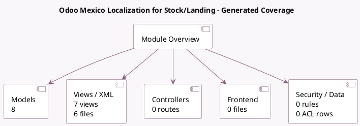

<!-- GENERATED:MODULE -->
---
tags: [odoo, enterprise, module]
---

# Odoo Mexico Localization for Stock/Landing

- Scope: Enterprise Addons
- Source: enterprise/l10n_mx_edi_landing
- Dependencies: [[docs/Community Addons/stock_landed_costs/stock_landed_costs|stock_landed_costs]], [[docs/Community Addons/sale_management/sale_management|sale_management]], [[docs/Community Addons/sale_stock/sale_stock|sale_stock]], [[docs/Enterprise Addons/l10n_mx_edi_extended/l10n_mx_edi_extended|l10n_mx_edi_extended]]

## Summary

Generate Electronic Invoice with custom numbers

## Generated coverage

- Models: 8
- XML files with UI/data artifacts: 6
- Views: 7
- Actions: 0
- Menus: 0
- Rules (ir.rule): 0
- Access CSV entries: 0
- Controller units: 0
- Frontend asset files: 0

## Module map

## Detail notes

- Models: [[docs/Enterprise Addons/l10n_mx_edi_landing/Models|Models]] (8)
- Views and XML: [[docs/Enterprise Addons/l10n_mx_edi_landing/Views|Views]] (6 files)

## Key models

- `account.move`
- `account.move.line`
- `product.template`
- `sale.order.line`
- `stock.landed.cost`
- `stock.lot`
- `stock.move.line`
- `stock.quant`

## Navigation

- [[../Enterprise Addons/Enterprise Addons|Back to scope]]
- [[../../docs/docs|Back to docs]]

<!-- GENERATED:MODULE -->

