<!-- GENERATED:MODEL -->
---
tags: [odoo, enterprise, generated, model]
---

# l10n_mx_edi.global_invoice.create

- Module: [[docs/Enterprise Addons/l10n_mx_edi_pos/l10n_mx_edi_pos|l10n_mx_edi_pos]]
- Scope: Enterprise Addons
- Defined in module: extension only
- Source files: `wizard/l10n_mx_edi_global_invoice_create.py`
- Python classes: `L10n_Mx_EdiGlobal_InvoiceCreate`

## Field footprint

- Detected fields: 1
- Field types: `Many2many` x 1
- Relation fields: 1

## Sample fields

- `pos_order_ids`: `Many2many` (comodel `pos.order`)

## Method hints

- Detected methods: 2
- Action methods: `action_create_global_invoice`
- Compute methods: none
- Onchange methods: none

## Direct relation diagram

```plantuml
@startuml
!define ODOO_COLOR_PRIMARY #714B67
!define ODOO_COLOR_ACCENT #875A7B
!define ODOO_COLOR_BG #FAF7FA

skinparam backgroundColor ODOO_COLOR_BG
skinparam defaultTextAlignment left
skinparam ArrowColor ODOO_COLOR_ACCENT
skinparam ClassBackgroundColor white
skinparam ClassBorderColor ODOO_COLOR_PRIMARY
skinparam ComponentBackgroundColor white
skinparam ComponentBorderColor ODOO_COLOR_PRIMARY
skinparam NoteBackgroundColor #FFF8FF
skinparam NoteBorderColor ODOO_COLOR_ACCENT
skinparam SequenceLifeLineBorderColor ODOO_COLOR_ACCENT
skinparam SequenceLifeLineBackgroundColor #FFFFFF
skinparam SequenceParticipantBorderColor ODOO_COLOR_PRIMARY
skinparam SequenceParticipantBackgroundColor #FFFFFF
skinparam sequence {
  ArrowColor ODOO_COLOR_ACCENT
  ActorBorderColor ODOO_COLOR_PRIMARY
}
title l10n_mx_edi.global_invoice.create - Direct Relations
class "l10n_mx_edi.global_invoice.create" as l10n_mx_edi_global_invoice_create
class "pos.order" as pos_order
l10n_mx_edi_global_invoice_create .. pos_order : pos_order_ids
@enduml
```

## Navigation

- **Parent:** [[docs/Enterprise Addons/l10n_mx_edi_pos/Models]]

<!-- GENERATED:MODEL -->
