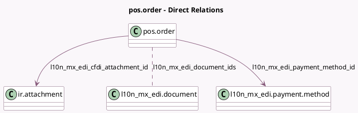

<!-- GENERATED:MODEL -->
---
tags: [odoo, enterprise, generated, model]
---

# pos.order

- Module: [[docs/Enterprise Addons/l10n_mx_edi_pos/l10n_mx_edi_pos|l10n_mx_edi_pos]]
- Scope: Enterprise Addons
- Defined in module: extension only
- Source files: `models/pos_order.py`
- Python classes: `PosOrder`

## Field footprint

- Detected fields: 10
- Field types: `Boolean` x 3, `Char` x 1, `Many2many` x 1, `Many2one` x 2, `Selection` x 3
- Relation fields: 3

## Sample fields

- `l10n_mx_edi_cfdi_attachment_id`: `Many2one` (comodel `ir.attachment`, compute `_compute_l10n_mx_edi_cfdi_state_and_attachment`, store `True`)
- `l10n_mx_edi_cfdi_sat_state`: `Selection` (compute `_compute_l10n_mx_edi_cfdi_state_and_attachment`, store `True`)
- `l10n_mx_edi_cfdi_state`: `Selection` (compute `_compute_l10n_mx_edi_cfdi_state_and_attachment`, store `True`)
- `l10n_mx_edi_cfdi_to_public`: `Boolean` (compute `_compute_l10n_mx_edi_cfdi_to_public`, store `True`)
- `l10n_mx_edi_cfdi_uuid`: `Char` (compute `_compute_l10n_mx_edi_cfdi_uuid`, store `True`)
- `l10n_mx_edi_document_ids`: `Many2many` (comodel `l10n_mx_edi.document`)
- `l10n_mx_edi_is_cfdi_needed`: `Boolean` (compute `_compute_l10n_mx_edi_is_cfdi_needed`, store `True`)
- `l10n_mx_edi_payment_method_id`: `Many2one` (comodel `l10n_mx_edi.payment.method`, compute `_compute_l10n_mx_edi_payment_method_id`)
- `l10n_mx_edi_update_sat_needed`: `Boolean` (compute `_compute_l10n_mx_edi_update_sat_needed`)
- `l10n_mx_edi_usage`: `Selection`

## Method hints

- Detected methods: 34
- Action methods: `action_pos_order_invoice`
- Compute methods: `_compute_l10n_mx_edi_cfdi_state_and_attachment`, `_compute_l10n_mx_edi_cfdi_to_public`, `_compute_l10n_mx_edi_cfdi_uuid`, `_compute_l10n_mx_edi_is_cfdi_needed`, `_compute_l10n_mx_edi_payment_method_id`, `_compute_l10n_mx_edi_update_sat_needed`
- Onchange methods: none

## Direct relation diagram

## Navigation

- **Parent:** [[docs/Enterprise Addons/l10n_mx_edi_pos/Models]]

<!-- GENERATED:MODEL -->
