<!-- GENERATED:MODEL -->
---
tags: [odoo, enterprise, generated, model]
---

# l10n_mx_edi.figure

- Module: [[docs/Enterprise Addons/l10n_mx_edi_stock/l10n_mx_edi_stock|l10n_mx_edi_stock]]
- Scope: Enterprise Addons
- Defined in module: yes
- Source files: `models/l10n_mx_edi_figures.py`
- Python classes: `L10nMxEdiFigure`
- Description: MX EDI Vehicle Intermediary Figure

## Field footprint

- Detected fields: 4
- Field types: `Many2many` x 1, `Many2one` x 2, `Selection` x 1
- Relation fields: 3

## Sample fields

- `operator_id`: `Many2one` (comodel `res.partner`)
- `part_ids`: `Many2many` (comodel `l10n_mx_edi.part`)
- `type`: `Selection`
- `vehicle_id`: `Many2one` (comodel `fleet.vehicle`)

## Method hints

- Detected methods: 0
- Action methods: none
- Compute methods: none
- Onchange methods: none

## Direct relation diagram

```plantuml
@startuml
!define ODOO_COLOR_PRIMARY #714B67
!define ODOO_COLOR_ACCENT #875A7B
!define ODOO_COLOR_BG #FAF7FA

skinparam backgroundColor ODOO_COLOR_BG
skinparam defaultTextAlignment left
skinparam ArrowColor ODOO_COLOR_ACCENT
skinparam ClassBackgroundColor white
skinparam ClassBorderColor ODOO_COLOR_PRIMARY
skinparam ComponentBackgroundColor white
skinparam ComponentBorderColor ODOO_COLOR_PRIMARY
skinparam NoteBackgroundColor #FFF8FF
skinparam NoteBorderColor ODOO_COLOR_ACCENT
skinparam SequenceLifeLineBorderColor ODOO_COLOR_ACCENT
skinparam SequenceLifeLineBackgroundColor #FFFFFF
skinparam SequenceParticipantBorderColor ODOO_COLOR_PRIMARY
skinparam SequenceParticipantBackgroundColor #FFFFFF
skinparam sequence {
  ArrowColor ODOO_COLOR_ACCENT
  ActorBorderColor ODOO_COLOR_PRIMARY
}
title l10n_mx_edi.figure - Direct Relations
class "l10n_mx_edi.figure" as l10n_mx_edi_figure
class "fleet.vehicle" as fleet_vehicle
class "l10n_mx_edi.part" as l10n_mx_edi_part
class "res.partner" as res_partner
l10n_mx_edi_figure --> fleet_vehicle : vehicle_id
l10n_mx_edi_figure --> res_partner : operator_id
l10n_mx_edi_figure .. l10n_mx_edi_part : part_ids
@enduml
```

## Navigation

- **Parent:** [[docs/Enterprise Addons/l10n_mx_edi_stock/Models]]

<!-- GENERATED:MODEL -->
