<!-- GENERATED:MODEL -->
---
tags: [odoo, enterprise, generated, model]
---

# product.template

- Module: [[docs/Enterprise Addons/l10n_mx_edi_stock/l10n_mx_edi_stock|l10n_mx_edi_stock]]
- Scope: Enterprise Addons
- Defined in module: extension only
- Source files: `models/product_template.py`
- Python classes: `ProductTemplate`

## Field footprint

- Detected fields: 5
- Field types: `Char` x 1, `Many2one` x 1, `Selection` x 3
- Relation fields: 1

## Sample fields

- `l10n_mx_edi_hazard_package_type`: `Selection` (compute `_compute_hazardous_material_fields`, store `True`)
- `l10n_mx_edi_hazardous_material`: `Selection` (related `unspsc_code_id.l10n_mx_edi_hazardous_material`)
- `l10n_mx_edi_hazardous_material_code_id`: `Many2one` (comodel `l10n_mx_edi.hazardous.material`, compute `_compute_hazardous_material_fields`, store `True`)
- `l10n_mx_edi_material_description`: `Char`
- `l10n_mx_edi_material_type`: `Selection`

## Method hints

- Detected methods: 1
- Action methods: none
- Compute methods: `_compute_hazardous_material_fields`
- Onchange methods: none

## Direct relation diagram

```plantuml
@startuml
!define ODOO_COLOR_PRIMARY #714B67
!define ODOO_COLOR_ACCENT #875A7B
!define ODOO_COLOR_BG #FAF7FA

skinparam backgroundColor ODOO_COLOR_BG
skinparam defaultTextAlignment left
skinparam ArrowColor ODOO_COLOR_ACCENT
skinparam ClassBackgroundColor white
skinparam ClassBorderColor ODOO_COLOR_PRIMARY
skinparam ComponentBackgroundColor white
skinparam ComponentBorderColor ODOO_COLOR_PRIMARY
skinparam NoteBackgroundColor #FFF8FF
skinparam NoteBorderColor ODOO_COLOR_ACCENT
skinparam SequenceLifeLineBorderColor ODOO_COLOR_ACCENT
skinparam SequenceLifeLineBackgroundColor #FFFFFF
skinparam SequenceParticipantBorderColor ODOO_COLOR_PRIMARY
skinparam SequenceParticipantBackgroundColor #FFFFFF
skinparam sequence {
  ArrowColor ODOO_COLOR_ACCENT
  ActorBorderColor ODOO_COLOR_PRIMARY
}
title product.template - Direct Relations
class "product.template" as product_template
class "l10n_mx_edi.hazardous.material" as l10n_mx_edi_hazardous_material
product_template --> l10n_mx_edi_hazardous_material : l10n_mx_edi_hazardous_material_code_id
@enduml
```

## Navigation

- **Parent:** [[docs/Enterprise Addons/l10n_mx_edi_stock/Models]]

<!-- GENERATED:MODEL -->
