<!-- GENERATED:MODEL -->
---
tags: [odoo, enterprise, generated, model]
---

# stock.picking

- Module: [[docs/Enterprise Addons/l10n_mx_edi_stock/l10n_mx_edi_stock|l10n_mx_edi_stock]]
- Scope: Enterprise Addons
- Defined in module: extension only
- Source files: `models/stock_picking.py`
- Python classes: `StockPicking`

## Field footprint

- Detected fields: 28
- Field types: `Boolean` x 3, `Char` x 7, `Datetime` x 1, `Float` x 6, `Integer` x 1, `Many2many` x 1, `Many2one` x 5, `One2many` x 1, `Selection` x 3
- Relation fields: 7

## Sample fields

- `l10n_mx_edi_cfdi_attachment_id`: `Many2one` (comodel `ir.attachment`, compute `_compute_l10n_mx_edi_cfdi_state_and_attachment`, store `True`)
- `l10n_mx_edi_cfdi_cancel_picking_id`: `Many2one` (comodel `stock.picking`, compute `_compute_l10n_mx_edi_cfdi_cancel_picking_id`)
- `l10n_mx_edi_cfdi_origin`: `Char`
- `l10n_mx_edi_cfdi_sat_state`: `Selection` (compute `_compute_l10n_mx_edi_cfdi_state_and_attachment`, store `True`)
- `l10n_mx_edi_cfdi_state`: `Selection` (compute `_compute_l10n_mx_edi_cfdi_state_and_attachment`, store `True`)
- `l10n_mx_edi_cfdi_uuid`: `Char` (compute `_compute_l10n_mx_edi_cfdi_uuid`, store `True`)
- `l10n_mx_edi_customs_doc_identification`: `Char`
- `l10n_mx_edi_customs_document_type_code`: `Char` (related `l10n_mx_edi_customs_document_type_id.code`)
- `l10n_mx_edi_customs_document_type_id`: `Many2one` (comodel `l10n_mx_edi.customs.document.type`)
- `l10n_mx_edi_customs_regime_ids`: `Many2many` (comodel `l10n_mx_edi.customs.regime`)
- `l10n_mx_edi_delivery_date`: `Datetime`
- `l10n_mx_edi_des_lat`: `Float` (related `partner_id.partner_latitude`)
- `l10n_mx_edi_des_lon`: `Float` (related `partner_id.partner_longitude`)
- `l10n_mx_edi_distance`: `Integer` (comodel `Distance to Destination (KM)`)
- `l10n_mx_edi_document_ids`: `One2many` (comodel `l10n_mx_edi.document`)
- `l10n_mx_edi_external_trade`: `Char` (compute `_compute_l10n_mx_edi_external_trade`)
- `l10n_mx_edi_extra_weight`: `Float`
- `l10n_mx_edi_gross_vehicle_weight`: `Float` (compute `_compute_l10n_mx_edi_gross_vehicle_weight`)
- `l10n_mx_edi_idccp`: `Char` (compute `_compute_l10n_mx_edi_idccp`)
- `l10n_mx_edi_importer_id`: `Many2one` (comodel `res.partner`)

## Method hints

- Detected methods: 32
- Action methods: none
- Compute methods: `_compute_l10n_mx_edi_cfdi_cancel_picking_id`, `_compute_l10n_mx_edi_cfdi_state_and_attachment`, `_compute_l10n_mx_edi_cfdi_uuid`, `_compute_l10n_mx_edi_external_trade`, `_compute_l10n_mx_edi_gross_vehicle_weight`, `_compute_l10n_mx_edi_idccp`, `_compute_l10n_mx_edi_is_cfdi_needed`, `_compute_l10n_mx_edi_is_delivery_guide_needed`, and 1 more
- Onchange methods: none

## Direct relation diagram

```plantuml
@startuml
!define ODOO_COLOR_PRIMARY #714B67
!define ODOO_COLOR_ACCENT #875A7B
!define ODOO_COLOR_BG #FAF7FA

skinparam backgroundColor ODOO_COLOR_BG
skinparam defaultTextAlignment left
skinparam ArrowColor ODOO_COLOR_ACCENT
skinparam ClassBackgroundColor white
skinparam ClassBorderColor ODOO_COLOR_PRIMARY
skinparam ComponentBackgroundColor white
skinparam ComponentBorderColor ODOO_COLOR_PRIMARY
skinparam NoteBackgroundColor #FFF8FF
skinparam NoteBorderColor ODOO_COLOR_ACCENT
skinparam SequenceLifeLineBorderColor ODOO_COLOR_ACCENT
skinparam SequenceLifeLineBackgroundColor #FFFFFF
skinparam SequenceParticipantBorderColor ODOO_COLOR_PRIMARY
skinparam SequenceParticipantBackgroundColor #FFFFFF
skinparam sequence {
  ArrowColor ODOO_COLOR_ACCENT
  ActorBorderColor ODOO_COLOR_PRIMARY
}
title stock.picking - Direct Relations
class "stock.picking" as stock_picking
class "fleet.vehicle" as fleet_vehicle
class "ir.attachment" as ir_attachment
class "l10n_mx_edi.customs.document.type" as l10n_mx_edi_customs_document_type
class "l10n_mx_edi.customs.regime" as l10n_mx_edi_customs_regime
class "l10n_mx_edi.document" as l10n_mx_edi_document
class "res.partner" as res_partner
class "stock.picking" as stock_picking
stock_picking --|> l10n_mx_edi_document : l10n_mx_edi_document_ids
stock_picking --> ir_attachment : l10n_mx_edi_cfdi_attachment_id
stock_picking --> stock_picking : l10n_mx_edi_cfdi_cancel_picking_id
stock_picking --> fleet_vehicle : l10n_mx_edi_vehicle_id
stock_picking .. l10n_mx_edi_customs_regime : l10n_mx_edi_customs_regime_ids
stock_picking --> l10n_mx_edi_customs_document_type : l10n_mx_edi_customs_document_type_id
stock_picking --> res_partner : l10n_mx_edi_importer_id
@enduml
```

## Navigation

- **Parent:** [[docs/Enterprise Addons/l10n_mx_edi_stock/Models]]

<!-- GENERATED:MODEL -->
