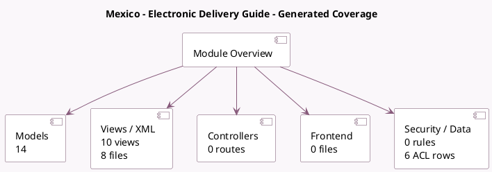

<!-- GENERATED:MODULE -->
---
tags: [odoo, enterprise, module]
---

# Mexico - Electronic Delivery Guide

- Scope: Enterprise Addons
- Source: enterprise/l10n_mx_edi_stock
- Dependencies: [[docs/Community Addons/fleet/fleet|fleet]], [[docs/Community Addons/stock_delivery/stock_delivery|stock_delivery]], [[docs/Enterprise Addons/l10n_mx_edi_extended/l10n_mx_edi_extended|l10n_mx_edi_extended]], [[docs/Enterprise Addons/web_map/web_map|web_map]]

## Generated coverage

- Models: 14
- XML files with UI/data artifacts: 8
- Views: 10
- Actions: 3
- Menus: 3
- Rules (ir.rule): 0
- Access CSV entries: 6
- Controller units: 0
- Frontend asset files: 0

## Module map

## Detail notes

- Models: [[docs/Enterprise Addons/l10n_mx_edi_stock/Models|Models]] (14)
- Views and XML: [[docs/Enterprise Addons/l10n_mx_edi_stock/Views|Views]] (8 files)

## Key models

- `fleet.vehicle`
- `l10n_mx_edi.customs.document.type`
- `l10n_mx_edi.customs.regime`
- `l10n_mx_edi.document`
- `l10n_mx_edi.figure`
- `l10n_mx_edi.hazardous.material`
- `l10n_mx_edi.part`
- `l10n_mx_edi.trailer`
- `product.template`
- `product.unspsc.code`
- `res.partner`
- `stock.move`

## Navigation

- [[../Enterprise Addons/Enterprise Addons|Back to scope]]
- [[../../docs/docs|Back to docs]]

<!-- GENERATED:MODULE -->

