<!-- GENERATED:MODEL -->
---
tags: [odoo, enterprise, generated, model]
---

# hr.version

- Module: [[docs/Enterprise Addons/l10n_mx_hr_payroll/l10n_mx_hr_payroll|l10n_mx_hr_payroll]]
- Scope: Enterprise Addons
- Defined in module: extension only
- Source files: `models/hr_version.py`
- Python classes: `HrVersion`

## Field footprint

- Detected fields: 8
- Field types: `Float` x 1, `Monetary` x 4, `One2many` x 2, `Selection` x 1
- Relation fields: 2

## Sample fields

- `l10n_mx_fonacot`: `One2many` (comodel `l10n.mx.hr.fonacot`)
- `l10n_mx_gasoline_amount`: `Monetary`
- `l10n_mx_holiday_bonus_rate`: `Float`
- `l10n_mx_infonavit`: `One2many` (comodel `l10n.mx.hr.infonavit`)
- `l10n_mx_meal_voucher_amount`: `Monetary`
- `l10n_mx_payment_period_vouchers`: `Selection`
- `l10n_mx_savings_fund`: `Monetary`
- `l10n_mx_transport_amount`: `Monetary`

## Method hints

- Detected methods: 1
- Action methods: none
- Compute methods: none
- Onchange methods: none

## Direct relation diagram

```plantuml
@startuml
!define ODOO_COLOR_PRIMARY #714B67
!define ODOO_COLOR_ACCENT #875A7B
!define ODOO_COLOR_BG #FAF7FA

skinparam backgroundColor ODOO_COLOR_BG
skinparam defaultTextAlignment left
skinparam ArrowColor ODOO_COLOR_ACCENT
skinparam ClassBackgroundColor white
skinparam ClassBorderColor ODOO_COLOR_PRIMARY
skinparam ComponentBackgroundColor white
skinparam ComponentBorderColor ODOO_COLOR_PRIMARY
skinparam NoteBackgroundColor #FFF8FF
skinparam NoteBorderColor ODOO_COLOR_ACCENT
skinparam SequenceLifeLineBorderColor ODOO_COLOR_ACCENT
skinparam SequenceLifeLineBackgroundColor #FFFFFF
skinparam SequenceParticipantBorderColor ODOO_COLOR_PRIMARY
skinparam SequenceParticipantBackgroundColor #FFFFFF
skinparam sequence {
  ArrowColor ODOO_COLOR_ACCENT
  ActorBorderColor ODOO_COLOR_PRIMARY
}
title hr.version - Direct Relations
class "hr.version" as hr_version
class "l10n.mx.hr.fonacot" as l10n_mx_hr_fonacot
class "l10n.mx.hr.infonavit" as l10n_mx_hr_infonavit
hr_version --|> l10n_mx_hr_infonavit : l10n_mx_infonavit
hr_version --|> l10n_mx_hr_fonacot : l10n_mx_fonacot
@enduml
```

## Navigation

- **Parent:** [[docs/Enterprise Addons/l10n_mx_hr_payroll/Models]]

<!-- GENERATED:MODEL -->
