<!-- GENERATED:MODEL -->
---
tags: [odoo, enterprise, generated, model]
---

# l10n.mx.hr.fonacot

- Module: [[docs/Enterprise Addons/l10n_mx_hr_payroll/l10n_mx_hr_payroll|l10n_mx_hr_payroll]]
- Scope: Enterprise Addons
- Defined in module: yes
- Source files: `models/l10n_mx_hr_fonacot.py`
- Python classes: `HrFonacot`
- Description: fonacot

## Field footprint

- Detected fields: 6
- Field types: `Many2one` x 3, `Monetary` x 2, `Selection` x 1
- Relation fields: 3

## Sample fields

- `company_id`: `Many2one` (related `version_id.company_id`)
- `currency_id`: `Many2one` (related `version_id.currency_id`)
- `extra_fixed_monthly_contribution`: `Monetary`
- `monthly_import`: `Monetary`
- `status`: `Selection`
- `version_id`: `Many2one` (comodel `hr.version`)

## Method hints

- Detected methods: 0
- Action methods: none
- Compute methods: none
- Onchange methods: none

## Direct relation diagram

```plantuml
@startuml
!define ODOO_COLOR_PRIMARY #714B67
!define ODOO_COLOR_ACCENT #875A7B
!define ODOO_COLOR_BG #FAF7FA

skinparam backgroundColor ODOO_COLOR_BG
skinparam defaultTextAlignment left
skinparam ArrowColor ODOO_COLOR_ACCENT
skinparam ClassBackgroundColor white
skinparam ClassBorderColor ODOO_COLOR_PRIMARY
skinparam ComponentBackgroundColor white
skinparam ComponentBorderColor ODOO_COLOR_PRIMARY
skinparam NoteBackgroundColor #FFF8FF
skinparam NoteBorderColor ODOO_COLOR_ACCENT
skinparam SequenceLifeLineBorderColor ODOO_COLOR_ACCENT
skinparam SequenceLifeLineBackgroundColor #FFFFFF
skinparam SequenceParticipantBorderColor ODOO_COLOR_PRIMARY
skinparam SequenceParticipantBackgroundColor #FFFFFF
skinparam sequence {
  ArrowColor ODOO_COLOR_ACCENT
  ActorBorderColor ODOO_COLOR_PRIMARY
}
title l10n.mx.hr.fonacot - Direct Relations
class "l10n.mx.hr.fonacot" as l10n_mx_hr_fonacot
class "hr.version" as hr_version
l10n_mx_hr_fonacot --> hr_version : version_id
@enduml
```

## Navigation

- **Parent:** [[docs/Enterprise Addons/l10n_mx_hr_payroll/Models]]

<!-- GENERATED:MODEL -->
