<!-- GENERATED:MODEL -->
---
tags: [odoo, enterprise, generated, model]
---

# hr.payslip

- Module: [[docs/Enterprise Addons/l10n_mx_hr_payroll_account_edi/l10n_mx_hr_payroll_account_edi|l10n_mx_hr_payroll_account_edi]]
- Scope: Enterprise Addons
- Defined in module: extension only
- Source files: `models/hr_payslip.py`
- Python classes: `HrPayslip`

## Field footprint

- Detected fields: 7
- Field types: `Char` x 2, `Many2one` x 2, `One2many` x 1, `Selection` x 2
- Relation fields: 3

## Sample fields

- `l10n_mx_edi_cfdi_attachment_id`: `Many2one` (comodel `ir.attachment`, compute `_compute_l10n_mx_edi_cfdi_state_and_attachment`, store `True`)
- `l10n_mx_edi_cfdi_cancel_id`: `Many2one` (comodel `hr.payslip`, compute `_compute_l10n_mx_edi_cfdi_cancel_id`)
- `l10n_mx_edi_cfdi_origin`: `Char`
- `l10n_mx_edi_cfdi_sat_state`: `Selection` (compute `_compute_l10n_mx_edi_cfdi_state_and_attachment`, store `True`)
- `l10n_mx_edi_cfdi_state`: `Selection` (compute `_compute_l10n_mx_edi_cfdi_state_and_attachment`, store `True`)
- `l10n_mx_edi_cfdi_uuid`: `Char` (compute `_compute_l10n_mx_edi_cfdi_uuid`, store `True`)
- `l10n_mx_edi_document_ids`: `One2many` (comodel `l10n_mx_edi.document`)

## Method hints

- Detected methods: 15
- Action methods: `action_generate_cfdi`, `action_print_cfdi`
- Compute methods: `_compute_l10n_mx_edi_cfdi_cancel_id`, `_compute_l10n_mx_edi_cfdi_state_and_attachment`, `_compute_l10n_mx_edi_cfdi_uuid`
- Onchange methods: none

## Direct relation diagram

```plantuml
@startuml
!define ODOO_COLOR_PRIMARY #714B67
!define ODOO_COLOR_ACCENT #875A7B
!define ODOO_COLOR_BG #FAF7FA

skinparam backgroundColor ODOO_COLOR_BG
skinparam defaultTextAlignment left
skinparam ArrowColor ODOO_COLOR_ACCENT
skinparam ClassBackgroundColor white
skinparam ClassBorderColor ODOO_COLOR_PRIMARY
skinparam ComponentBackgroundColor white
skinparam ComponentBorderColor ODOO_COLOR_PRIMARY
skinparam NoteBackgroundColor #FFF8FF
skinparam NoteBorderColor ODOO_COLOR_ACCENT
skinparam SequenceLifeLineBorderColor ODOO_COLOR_ACCENT
skinparam SequenceLifeLineBackgroundColor #FFFFFF
skinparam SequenceParticipantBorderColor ODOO_COLOR_PRIMARY
skinparam SequenceParticipantBackgroundColor #FFFFFF
skinparam sequence {
  ArrowColor ODOO_COLOR_ACCENT
  ActorBorderColor ODOO_COLOR_PRIMARY
}
title hr.payslip - Direct Relations
class "hr.payslip" as hr_payslip
class "hr.payslip" as hr_payslip
class "ir.attachment" as ir_attachment
class "l10n_mx_edi.document" as l10n_mx_edi_document
hr_payslip --|> l10n_mx_edi_document : l10n_mx_edi_document_ids
hr_payslip --> ir_attachment : l10n_mx_edi_cfdi_attachment_id
hr_payslip --> hr_payslip : l10n_mx_edi_cfdi_cancel_id
@enduml
```

## Navigation

- **Parent:** [[docs/Enterprise Addons/l10n_mx_hr_payroll_account_edi/Models]]

<!-- GENERATED:MODEL -->
