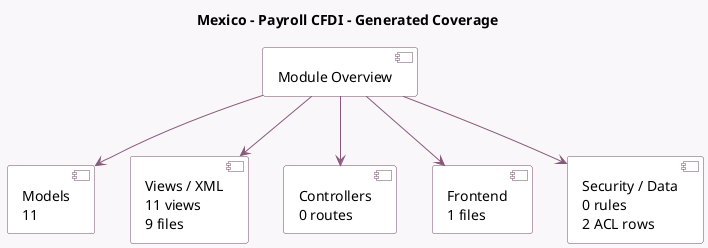

<!-- GENERATED:MODULE -->
---
tags: [odoo, enterprise, module]
---

# Mexico - Payroll CFDI

- Scope: Enterprise Addons
- Source: enterprise/l10n_mx_hr_payroll_account_edi
- Dependencies: [[docs/Enterprise Addons/l10n_mx_hr_payroll_account/l10n_mx_hr_payroll_account|l10n_mx_hr_payroll_account]], [[docs/Enterprise Addons/l10n_mx_edi/l10n_mx_edi|l10n_mx_edi]]

## Generated coverage

- Models: 11
- XML files with UI/data artifacts: 9
- Views: 11
- Actions: 2
- Menus: 2
- Rules (ir.rule): 0
- Access CSV entries: 2
- Controller units: 0
- Frontend asset files: 1

## Module map

## Detail notes

- Models: [[docs/Enterprise Addons/l10n_mx_hr_payroll_account_edi/Models|Models]] (11)
- Views and XML: [[docs/Enterprise Addons/l10n_mx_hr_payroll_account_edi/Views|Views]] (9 files)
- Frontend: [[docs/Enterprise Addons/l10n_mx_hr_payroll_account_edi/Frontend|Frontend]] (1 files)

## Key models

- `hr.employee`
- `hr.payroll.structure`
- `hr.payslip`
- `hr.payslip.run`
- `hr.salary.rule`
- `hr.version`
- `hr.work.entry.type`
- `l10n.mx.concept`
- `l10n_mx_edi.document`
- `res.company`
- `res.config.settings`

## Navigation

- [[../Enterprise Addons/Enterprise Addons|Back to scope]]
- [[../../docs/docs|Back to docs]]

<!-- GENERATED:MODULE -->

