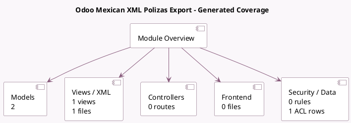

<!-- GENERATED:MODULE -->
---
tags: [odoo, enterprise, module]
---

# Odoo Mexican XML Polizas Export

- Scope: Enterprise Addons
- Source: enterprise/l10n_mx_xml_polizas
- Dependencies: [[docs/Enterprise Addons/l10n_mx_reports/l10n_mx_reports|l10n_mx_reports]], [[docs/Enterprise Addons/l10n_mx_edi/l10n_mx_edi|l10n_mx_edi]]

## Summary

XML Export of the Journal Entries for the Mexican Tax Authorities for a compulsory audit.

## Generated coverage

- Models: 2
- XML files with UI/data artifacts: 1
- Views: 1
- Actions: 1
- Menus: 0
- Rules (ir.rule): 0
- Access CSV entries: 1
- Controller units: 0
- Frontend asset files: 0

## Module map

## Detail notes

- Models: [[docs/Enterprise Addons/l10n_mx_xml_polizas/Models|Models]] (2)
- Views and XML: [[docs/Enterprise Addons/l10n_mx_xml_polizas/Views|Views]] (1 files)

## Key models

- `account.general.ledger.report.handler`
- `l10n_mx_xml_polizas.xml_polizas_wizard`

## Navigation

- [[../Enterprise Addons/Enterprise Addons|Back to scope]]
- [[../../docs/docs|Back to docs]]

<!-- GENERATED:MODULE -->

