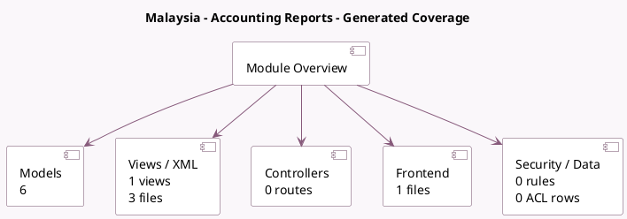

<!-- GENERATED:MODULE -->
---
tags: [odoo, enterprise, module]
---

# Malaysia - Accounting Reports

- Scope: Enterprise Addons
- Source: enterprise/l10n_my_reports
- Dependencies: [[docs/Community Addons/l10n_my/l10n_my|l10n_my]], [[docs/Enterprise Addons/account_followup/account_followup|account_followup]], [[docs/Enterprise Addons/account_reports/account_reports|account_reports]]

## Generated coverage

- Models: 6
- XML files with UI/data artifacts: 3
- Views: 1
- Actions: 2
- Menus: 0
- Rules (ir.rule): 0
- Access CSV entries: 0
- Controller units: 0
- Frontend asset files: 1

## Module map

## Detail notes

- Models: [[docs/Enterprise Addons/l10n_my_reports/Models|Models]] (6)
- Views and XML: [[docs/Enterprise Addons/l10n_my_reports/Views|Views]] (3 files)
- Frontend: [[docs/Enterprise Addons/l10n_my_reports/Frontend|Frontend]] (1 files)

## Key models

- `account.aged.receivable.report.handler`
- `l10n_my.sst_02_b1.report.handler`
- `report.l10n_my_reports.report_statement_account`
- `res.company`
- `res.config.settings`
- `res.partner`

## Navigation

- [[../Enterprise Addons/Enterprise Addons|Back to scope]]
- [[../../docs/docs|Back to docs]]

<!-- GENERATED:MODULE -->

