<!-- GENERATED:MODEL -->
---
tags: [odoo, enterprise, generated, model]
---

# l10n_nl_reports.sbr.status.service

- Module: [[docs/Enterprise Addons/l10n_nl_reports/l10n_nl_reports|l10n_nl_reports]]
- Scope: Enterprise Addons
- Defined in module: yes
- Source files: `models/l10n_nl_reports_sbr_status_service.py`
- Python classes: `L10n_Nl_ReportsSbrStatusService`
- Description: Status checking service for Digipoort submission

## Field footprint

- Detected fields: 6
- Field types: `Boolean` x 2, `Char` x 2, `Many2one` x 2
- Relation fields: 2

## Sample fields

- `closing_entry_id`: `Many2one` (comodel `account.move`)
- `company_id`: `Many2one` (comodel `res.company`)
- `is_done`: `Boolean` (comodel `Is the cycle finished?`)
- `is_test`: `Boolean` (comodel `Is it a test?`)
- `kenmerk`: `Char` (comodel `Message Exchange ID`)
- `report_name`: `Char` (comodel `Name of the submitted report`)

## Method hints

- Detected methods: 1
- Action methods: none
- Compute methods: none
- Onchange methods: none

## Direct relation diagram

```plantuml
@startuml
!define ODOO_COLOR_PRIMARY #714B67
!define ODOO_COLOR_ACCENT #875A7B
!define ODOO_COLOR_BG #FAF7FA

skinparam backgroundColor ODOO_COLOR_BG
skinparam defaultTextAlignment left
skinparam ArrowColor ODOO_COLOR_ACCENT
skinparam ClassBackgroundColor white
skinparam ClassBorderColor ODOO_COLOR_PRIMARY
skinparam ComponentBackgroundColor white
skinparam ComponentBorderColor ODOO_COLOR_PRIMARY
skinparam NoteBackgroundColor #FFF8FF
skinparam NoteBorderColor ODOO_COLOR_ACCENT
skinparam SequenceLifeLineBorderColor ODOO_COLOR_ACCENT
skinparam SequenceLifeLineBackgroundColor #FFFFFF
skinparam SequenceParticipantBorderColor ODOO_COLOR_PRIMARY
skinparam SequenceParticipantBackgroundColor #FFFFFF
skinparam sequence {
  ArrowColor ODOO_COLOR_ACCENT
  ActorBorderColor ODOO_COLOR_PRIMARY
}
title l10n_nl_reports.sbr.status.service - Direct Relations
class "l10n_nl_reports.sbr.status.service" as l10n_nl_reports_sbr_status_service
class "account.move" as account_move
class "res.company" as res_company
l10n_nl_reports_sbr_status_service --> res_company : company_id
l10n_nl_reports_sbr_status_service --> account_move : closing_entry_id
@enduml
```

## Navigation

- **Parent:** [[docs/Enterprise Addons/l10n_nl_reports/Models]]

<!-- GENERATED:MODEL -->
