<!-- GENERATED:MODEL -->
---
tags: [odoo, enterprise, generated, model]
---

# l10n_nl_reports.sbr.tax.report.wizard

- Module: [[docs/Enterprise Addons/l10n_nl_reports/l10n_nl_reports|l10n_nl_reports]]
- Scope: Enterprise Addons
- Defined in module: yes
- Source files: `wizard/l10n_nl_reports_sbr_tax_report_wizard.py`
- Python classes: `L10n_Nl_ReportsSbrTaxReportWizard`
- Description: L10n NL Tax Report for SBR Wizard

## Field footprint

- Detected fields: 11
- Field types: `Boolean` x 2, `Char` x 5, `Date` x 2, `Many2one` x 1, `Selection` x 1
- Relation fields: 1

## Sample fields

- `can_report_be_sent`: `Boolean` (compute `_compute_sending_conditions`)
- `company_id`: `Many2one` (comodel `res.company`)
- `contact_initials`: `Char`
- `contact_phone`: `Char`
- `contact_prefix`: `Char`
- `contact_surname`: `Char`
- `contact_type`: `Selection`
- `date_from`: `Date`
- `date_to`: `Date`
- `is_test`: `Boolean`
- `tax_consultant_number`: `Char`

## Method hints

- Detected methods: 10
- Action methods: `action_download_xbrl_file`
- Compute methods: `_compute_sending_conditions`
- Onchange methods: none

## Direct relation diagram

```plantuml
@startuml
!define ODOO_COLOR_PRIMARY #714B67
!define ODOO_COLOR_ACCENT #875A7B
!define ODOO_COLOR_BG #FAF7FA

skinparam backgroundColor ODOO_COLOR_BG
skinparam defaultTextAlignment left
skinparam ArrowColor ODOO_COLOR_ACCENT
skinparam ClassBackgroundColor white
skinparam ClassBorderColor ODOO_COLOR_PRIMARY
skinparam ComponentBackgroundColor white
skinparam ComponentBorderColor ODOO_COLOR_PRIMARY
skinparam NoteBackgroundColor #FFF8FF
skinparam NoteBorderColor ODOO_COLOR_ACCENT
skinparam SequenceLifeLineBorderColor ODOO_COLOR_ACCENT
skinparam SequenceLifeLineBackgroundColor #FFFFFF
skinparam SequenceParticipantBorderColor ODOO_COLOR_PRIMARY
skinparam SequenceParticipantBackgroundColor #FFFFFF
skinparam sequence {
  ArrowColor ODOO_COLOR_ACCENT
  ActorBorderColor ODOO_COLOR_PRIMARY
}
title l10n_nl_reports.sbr.tax.report.wizard - Direct Relations
class "l10n_nl_reports.sbr.tax.report.wizard" as l10n_nl_reports_sbr_tax_report_wizard
class "res.company" as res_company
l10n_nl_reports_sbr_tax_report_wizard --> res_company : company_id
@enduml
```

## Navigation

- **Parent:** [[docs/Enterprise Addons/l10n_nl_reports/Models]]

<!-- GENERATED:MODEL -->
