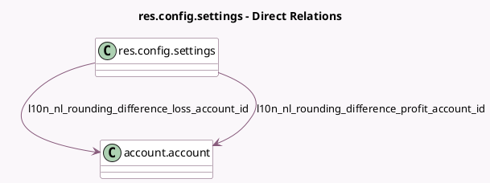

<!-- GENERATED:MODEL -->
---
tags: [odoo, enterprise, generated, model]
---

# res.config.settings

- Module: [[docs/Enterprise Addons/l10n_nl_reports/l10n_nl_reports|l10n_nl_reports]]
- Scope: Enterprise Addons
- Defined in module: extension only
- Source files: `models/res_config_settings.py`
- Python classes: `ResConfigSettings`

## Field footprint

- Detected fields: 3
- Field types: `Many2one` x 3
- Relation fields: 3

## Sample fields

- `l10n_nl_reports_sbr_cert_id`: `Many2one` (related `company_id.l10n_nl_reports_sbr_cert_id`)
- `l10n_nl_rounding_difference_loss_account_id`: `Many2one` (comodel `account.account`, related `company_id.l10n_nl_rounding_difference_loss_account_id`)
- `l10n_nl_rounding_difference_profit_account_id`: `Many2one` (comodel `account.account`, related `company_id.l10n_nl_rounding_difference_profit_account_id`)

## Method hints

- Detected methods: 0
- Action methods: none
- Compute methods: none
- Onchange methods: none

## Direct relation diagram

## Navigation

- **Parent:** [[docs/Enterprise Addons/l10n_nl_reports/Models]]

<!-- GENERATED:MODEL -->
