<!-- GENERATED:MODEL -->
---
tags: [odoo, enterprise, generated, model]
---

# account.batch.payment

- Module: [[docs/Enterprise Addons/l10n_nz_eft/l10n_nz_eft|l10n_nz_eft]]
- Scope: Enterprise Addons
- Defined in module: extension only
- Source files: `models/account_batch_payment.py`
- Python classes: `AccountBatchPayment`

## Field footprint

- Detected fields: 7
- Field types: `Char` x 4, `Many2one` x 2, `Selection` x 1
- Relation fields: 2

## Sample fields

- `l10n_nz_batch_code`: `Char`
- `l10n_nz_batch_particulars`: `Char`
- `l10n_nz_batch_reference`: `Char`
- `l10n_nz_company_partner_id`: `Many2one` (related `journal_id.company_id.partner_id`)
- `l10n_nz_dd_info`: `Char`
- `l10n_nz_dishonour_account_id`: `Many2one` (comodel `res.partner.bank`)
- `l10n_nz_file_format`: `Selection`

## Method hints

- Detected methods: 14
- Action methods: none
- Compute methods: none
- Onchange methods: none

## Direct relation diagram

```plantuml
@startuml
!define ODOO_COLOR_PRIMARY #714B67
!define ODOO_COLOR_ACCENT #875A7B
!define ODOO_COLOR_BG #FAF7FA

skinparam backgroundColor ODOO_COLOR_BG
skinparam defaultTextAlignment left
skinparam ArrowColor ODOO_COLOR_ACCENT
skinparam ClassBackgroundColor white
skinparam ClassBorderColor ODOO_COLOR_PRIMARY
skinparam ComponentBackgroundColor white
skinparam ComponentBorderColor ODOO_COLOR_PRIMARY
skinparam NoteBackgroundColor #FFF8FF
skinparam NoteBorderColor ODOO_COLOR_ACCENT
skinparam SequenceLifeLineBorderColor ODOO_COLOR_ACCENT
skinparam SequenceLifeLineBackgroundColor #FFFFFF
skinparam SequenceParticipantBorderColor ODOO_COLOR_PRIMARY
skinparam SequenceParticipantBackgroundColor #FFFFFF
skinparam sequence {
  ArrowColor ODOO_COLOR_ACCENT
  ActorBorderColor ODOO_COLOR_PRIMARY
}
title account.batch.payment - Direct Relations
class "account.batch.payment" as account_batch_payment
class "res.partner.bank" as res_partner_bank
account_batch_payment --> res_partner_bank : l10n_nz_dishonour_account_id
@enduml
```

## Navigation

- **Parent:** [[docs/Enterprise Addons/l10n_nz_eft/Models]]

<!-- GENERATED:MODEL -->
