<!-- GENERATED:MODEL -->
---
tags: [odoo, enterprise, generated, model]
---

# account.payment

- Module: [[docs/Enterprise Addons/l10n_nz_eft/l10n_nz_eft|l10n_nz_eft]]
- Scope: Enterprise Addons
- Defined in module: extension only
- Source files: `models/account_payment.py`
- Python classes: `AccountPayment`

## Field footprint

- Detected fields: 6
- Field types: `Char` x 4, `Many2many` x 1, `Many2one` x 1
- Relation fields: 2

## Sample fields

- `l10n_nz_available_dd_bank_ids`: `Many2many` (comodel `res.partner.bank`, compute `_compute_l10n_nz_available_dd_bank_ids`)
- `l10n_nz_dd_account_id`: `Many2one` (comodel `res.partner.bank`, compute `_compute_l10n_nz_dd_account_id`, store `True`)
- `l10n_nz_payee_code`: `Char`
- `l10n_nz_payee_particulars`: `Char`
- `l10n_nz_payer_code`: `Char`
- `l10n_nz_payer_particulars`: `Char`

## Method hints

- Detected methods: 5
- Action methods: `action_post`
- Compute methods: `_compute_l10n_nz_available_dd_bank_ids`, `_compute_l10n_nz_dd_account_id`
- Onchange methods: none

## Direct relation diagram

```plantuml
@startuml
!define ODOO_COLOR_PRIMARY #714B67
!define ODOO_COLOR_ACCENT #875A7B
!define ODOO_COLOR_BG #FAF7FA

skinparam backgroundColor ODOO_COLOR_BG
skinparam defaultTextAlignment left
skinparam ArrowColor ODOO_COLOR_ACCENT
skinparam ClassBackgroundColor white
skinparam ClassBorderColor ODOO_COLOR_PRIMARY
skinparam ComponentBackgroundColor white
skinparam ComponentBorderColor ODOO_COLOR_PRIMARY
skinparam NoteBackgroundColor #FFF8FF
skinparam NoteBorderColor ODOO_COLOR_ACCENT
skinparam SequenceLifeLineBorderColor ODOO_COLOR_ACCENT
skinparam SequenceLifeLineBackgroundColor #FFFFFF
skinparam SequenceParticipantBorderColor ODOO_COLOR_PRIMARY
skinparam SequenceParticipantBackgroundColor #FFFFFF
skinparam sequence {
  ArrowColor ODOO_COLOR_ACCENT
  ActorBorderColor ODOO_COLOR_PRIMARY
}
title account.payment - Direct Relations
class "account.payment" as account_payment
class "res.partner.bank" as res_partner_bank
account_payment .. res_partner_bank : l10n_nz_available_dd_bank_ids
account_payment --> res_partner_bank : l10n_nz_dd_account_id
@enduml
```

## Navigation

- **Parent:** [[docs/Enterprise Addons/l10n_nz_eft/Models]]

<!-- GENERATED:MODEL -->
