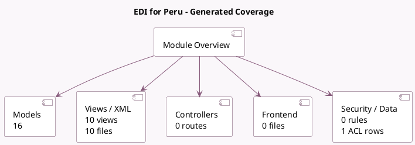

<!-- GENERATED:MODULE -->
---
tags: [odoo, enterprise, module]
---

# EDI for Peru

- Scope: Enterprise Addons
- Source: enterprise/l10n_pe_edi
- Dependencies: [[docs/Community Addons/iap/iap|iap]], [[docs/Community Addons/l10n_pe/l10n_pe|l10n_pe]], [[docs/Enterprise Addons/product_unspsc/product_unspsc|product_unspsc]], [[docs/Community Addons/account_edi/account_edi|account_edi]], [[docs/Community Addons/account_edi_ubl_cii/account_edi_ubl_cii|account_edi_ubl_cii]], [[docs/Community Addons/certificate/certificate|certificate]]

## Summary

Electronic Invoicing for Peru (OSE method) and UBL 2.1

## Generated coverage

- Models: 16
- XML files with UI/data artifacts: 10
- Views: 10
- Actions: 1
- Menus: 2
- Rules (ir.rule): 0
- Access CSV entries: 1
- Controller units: 0
- Frontend asset files: 0

## Module map

## Detail notes

- Models: [[docs/Enterprise Addons/l10n_pe_edi/Models|Models]] (16)
- Views and XML: [[docs/Enterprise Addons/l10n_pe_edi/Views|Views]] (10 files)

## Key models

- `account.chart.template`
- `account.debit.note`
- `account.edi.document`
- `account.edi.format`
- `account.edi.xml.ubl_pe`
- `account.journal`
- `account.move`
- `account.move.line`
- `account.move.reversal`
- `account.tax`
- `account.tax.group`
- `l10n_pe_edi.cancel`

## Navigation

- [[../Enterprise Addons/Enterprise Addons|Back to scope]]
- [[../../docs/docs|Back to docs]]

<!-- GENERATED:MODULE -->

