<!-- GENERATED:MODEL -->
---
tags: [odoo, enterprise, generated, model]
---

# stock.picking

- Module: [[docs/Enterprise Addons/l10n_pe_edi_stock/l10n_pe_edi_stock|l10n_pe_edi_stock]]
- Scope: Enterprise Addons
- Defined in module: extension only
- Source files: `models/stock_picking.py`
- Python classes: `StockPicking`

## Field footprint

- Detected fields: 14
- Field types: `Binary` x 1, `Char` x 4, `Date` x 1, `Html` x 1, `Many2one` x 2, `Selection` x 4, `Text` x 1
- Relation fields: 2

## Sample fields

- `country_code`: `Char` (related `company_id.country_id.code`)
- `l10n_latam_document_number`: `Char`
- `l10n_pe_edi_content`: `Binary` (compute `_l10n_pe_edi_compute_edi_content`)
- `l10n_pe_edi_departure_start_date`: `Date`
- `l10n_pe_edi_document_number`: `Char`
- `l10n_pe_edi_error`: `Html`
- `l10n_pe_edi_observation`: `Text`
- `l10n_pe_edi_operator_id`: `Many2one` (comodel `res.partner`, compute `_compute_l10n_pe_edi_operator`, store `True`)
- `l10n_pe_edi_reason_for_transfer`: `Selection` (compute `_compute_l10n_pe_edi_reason_for_transfer`, store `True`)
- `l10n_pe_edi_related_document_type`: `Selection`
- `l10n_pe_edi_status`: `Selection`
- `l10n_pe_edi_ticket_number`: `Char`
- `l10n_pe_edi_transport_type`: `Selection`
- `l10n_pe_edi_vehicle_id`: `Many2one` (comodel `l10n_pe_edi.vehicle`)

## Method hints

- Detected methods: 20
- Action methods: `action_send_delivery_guide`
- Compute methods: `_compute_l10n_pe_edi_operator`, `_compute_l10n_pe_edi_reason_for_transfer`
- Onchange methods: none

## Direct relation diagram

```plantuml
@startuml
!define ODOO_COLOR_PRIMARY #714B67
!define ODOO_COLOR_ACCENT #875A7B
!define ODOO_COLOR_BG #FAF7FA

skinparam backgroundColor ODOO_COLOR_BG
skinparam defaultTextAlignment left
skinparam ArrowColor ODOO_COLOR_ACCENT
skinparam ClassBackgroundColor white
skinparam ClassBorderColor ODOO_COLOR_PRIMARY
skinparam ComponentBackgroundColor white
skinparam ComponentBorderColor ODOO_COLOR_PRIMARY
skinparam NoteBackgroundColor #FFF8FF
skinparam NoteBorderColor ODOO_COLOR_ACCENT
skinparam SequenceLifeLineBorderColor ODOO_COLOR_ACCENT
skinparam SequenceLifeLineBackgroundColor #FFFFFF
skinparam SequenceParticipantBorderColor ODOO_COLOR_PRIMARY
skinparam SequenceParticipantBackgroundColor #FFFFFF
skinparam sequence {
  ArrowColor ODOO_COLOR_ACCENT
  ActorBorderColor ODOO_COLOR_PRIMARY
}
title stock.picking - Direct Relations
class "stock.picking" as stock_picking
class "l10n_pe_edi.vehicle" as l10n_pe_edi_vehicle
class "res.partner" as res_partner
stock_picking --> l10n_pe_edi_vehicle : l10n_pe_edi_vehicle_id
stock_picking --> res_partner : l10n_pe_edi_operator_id
@enduml
```

## Navigation

- **Parent:** [[docs/Enterprise Addons/l10n_pe_edi_stock/Models]]

<!-- GENERATED:MODEL -->
