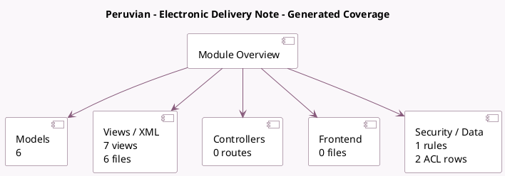

<!-- GENERATED:MODULE -->
---
tags: [odoo, enterprise, module]
---

# Peruvian - Electronic Delivery Note

- Scope: Enterprise Addons
- Source: enterprise/l10n_pe_edi_stock
- Dependencies: [[docs/Community Addons/stock_delivery/stock_delivery|stock_delivery]], [[docs/Enterprise Addons/l10n_pe_edi/l10n_pe_edi|l10n_pe_edi]]

## Summary

Electronic Delivery Note for Peru (OSE method) and UBL 2.1

## Generated coverage

- Models: 6
- XML files with UI/data artifacts: 6
- Views: 7
- Actions: 2
- Menus: 2
- Rules (ir.rule): 1
- Access CSV entries: 2
- Controller units: 0
- Frontend asset files: 0

## Module map

## Detail notes

- Models: [[docs/Enterprise Addons/l10n_pe_edi_stock/Models|Models]] (6)
- Views and XML: [[docs/Enterprise Addons/l10n_pe_edi_stock/Views|Views]] (6 files)

## Key models

- `l10n_pe_edi.vehicle`
- `product.template`
- `res.company`
- `res.config.settings`
- `res.partner`
- `stock.picking`

## Navigation

- [[../Enterprise Addons/Enterprise Addons|Back to scope]]
- [[../../docs/docs|Back to docs]]

<!-- GENERATED:MODULE -->

