<!-- GENERATED:MODEL -->
---
tags: [odoo, enterprise, generated, model]
---

# account.move

- Module: [[docs/Enterprise Addons/l10n_pe_reports/l10n_pe_reports|l10n_pe_reports]]
- Scope: Enterprise Addons
- Defined in module: extension only
- Source files: `models/account_move.py`
- Python classes: `AccountMove`

## Field footprint

- Detected fields: 6
- Field types: `Char` x 1, `Date` x 1, `Many2one` x 2, `Selection` x 2
- Relation fields: 2

## Sample fields

- `l10n_pe_detraction_date`: `Date`
- `l10n_pe_detraction_number`: `Char`
- `l10n_pe_dua_invoice_id`: `Many2one` (comodel `account.move`)
- `l10n_pe_service_modality`: `Selection`
- `l10n_pe_sunat_transaction_type`: `Selection`
- `l10n_pe_usage_type_id`: `Many2one` (comodel `l10n_pe.ple.usage`)

## Method hints

- Detected methods: 1
- Action methods: none
- Compute methods: none
- Onchange methods: none

## Direct relation diagram

```plantuml
@startuml
!define ODOO_COLOR_PRIMARY #714B67
!define ODOO_COLOR_ACCENT #875A7B
!define ODOO_COLOR_BG #FAF7FA

skinparam backgroundColor ODOO_COLOR_BG
skinparam defaultTextAlignment left
skinparam ArrowColor ODOO_COLOR_ACCENT
skinparam ClassBackgroundColor white
skinparam ClassBorderColor ODOO_COLOR_PRIMARY
skinparam ComponentBackgroundColor white
skinparam ComponentBorderColor ODOO_COLOR_PRIMARY
skinparam NoteBackgroundColor #FFF8FF
skinparam NoteBorderColor ODOO_COLOR_ACCENT
skinparam SequenceLifeLineBorderColor ODOO_COLOR_ACCENT
skinparam SequenceLifeLineBackgroundColor #FFFFFF
skinparam SequenceParticipantBorderColor ODOO_COLOR_PRIMARY
skinparam SequenceParticipantBackgroundColor #FFFFFF
skinparam sequence {
  ArrowColor ODOO_COLOR_ACCENT
  ActorBorderColor ODOO_COLOR_PRIMARY
}
title account.move - Direct Relations
class "account.move" as account_move
class "account.move" as account_move
class "l10n_pe.ple.usage" as l10n_pe_ple_usage
account_move --> account_move : l10n_pe_dua_invoice_id
account_move --> l10n_pe_ple_usage : l10n_pe_usage_type_id
@enduml
```

## Navigation

- **Parent:** [[docs/Enterprise Addons/l10n_pe_reports/Models]]

<!-- GENERATED:MODEL -->
