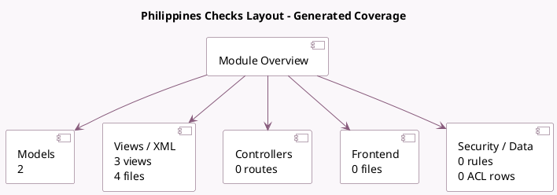

<!-- GENERATED:MODULE -->
---
tags: [odoo, enterprise, module]
---

# Philippines Checks Layout

- Scope: Enterprise Addons
- Source: enterprise/l10n_ph_check_printing
- Dependencies: [[docs/Community Addons/account_check_printing/account_check_printing|account_check_printing]], [[docs/Community Addons/l10n_ph/l10n_ph|l10n_ph]]

## Summary

Print PH Checks

## Generated coverage

- Models: 2
- XML files with UI/data artifacts: 4
- Views: 3
- Actions: 2
- Menus: 1
- Rules (ir.rule): 0
- Access CSV entries: 0
- Controller units: 0
- Frontend asset files: 0

## Module map

## Detail notes

- Models: [[docs/Enterprise Addons/l10n_ph_check_printing/Models|Models]] (2)
- Views and XML: [[docs/Enterprise Addons/l10n_ph_check_printing/Views|Views]] (4 files)

## Key models

- `account.payment`
- `res.company`

## Navigation

- [[../Enterprise Addons/Enterprise Addons|Back to scope]]
- [[../../docs/docs|Back to docs]]

<!-- GENERATED:MODULE -->

