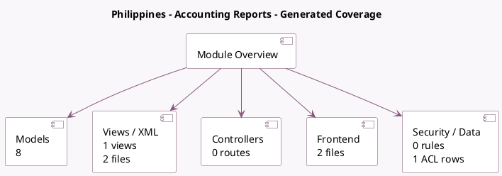

<!-- GENERATED:MODULE -->
---
tags: [odoo, enterprise, module]
---

# Philippines - Accounting Reports

- Scope: Enterprise Addons
- Source: enterprise/l10n_ph_reports
- Dependencies: [[docs/Community Addons/l10n_ph/l10n_ph|l10n_ph]], [[docs/Enterprise Addons/account_reports/account_reports|account_reports]]

## Summary

Accounting reports for the Philippines
    

## Generated coverage

- Models: 8
- XML files with UI/data artifacts: 2
- Views: 1
- Actions: 1
- Menus: 1
- Rules (ir.rule): 0
- Access CSV entries: 1
- Controller units: 0
- Frontend asset files: 2

## Module map

## Detail notes

- Models: [[docs/Enterprise Addons/l10n_ph_reports/Models|Models]] (8)
- Views and XML: [[docs/Enterprise Addons/l10n_ph_reports/Views|Views]] (2 files)
- Frontend: [[docs/Enterprise Addons/l10n_ph_reports/Frontend|Frontend]] (2 files)

## Key models

- `l10n_ph.generic.report.handler`
- `l10n_ph.qap.report.handler`
- `l10n_ph.sawt.report.handler`
- `l10n_ph.sawt_qap.report.handler`
- `l10n_ph.slp.report.handler`
- `l10n_ph.sls.report.handler`
- `l10n_ph.slsp.report.handler`
- `l10n_ph_reports.dat.file.export`

## Navigation

- [[../Enterprise Addons/Enterprise Addons|Back to scope]]
- [[../../docs/docs|Back to docs]]

<!-- GENERATED:MODULE -->

