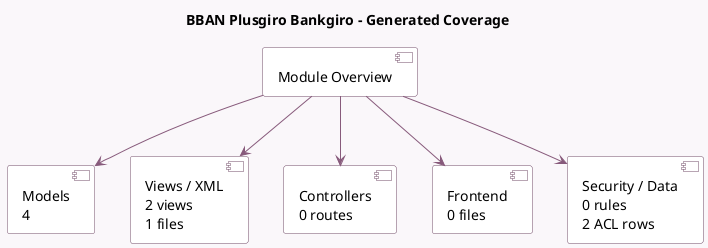

<!-- GENERATED:MODULE -->
---
tags: [odoo, enterprise, module]
---

# BBAN Plusgiro Bankgiro

- Scope: Enterprise Addons
- Source: enterprise/l10n_se_bban
- Dependencies: [[docs/Enterprise Addons/account_iso20022/account_iso20022|account_iso20022]], [[docs/Community Addons/l10n_se/l10n_se|l10n_se]]

## Summary

Implements BBAN Plusgiro Bankgiro

## Generated coverage

- Models: 4
- XML files with UI/data artifacts: 1
- Views: 2
- Actions: 1
- Menus: 1
- Rules (ir.rule): 0
- Access CSV entries: 2
- Controller units: 0
- Frontend asset files: 0

## Module map

## Detail notes

- Models: [[docs/Enterprise Addons/l10n_se_bban/Models|Models]] (4)
- Views and XML: [[docs/Enterprise Addons/l10n_se_bban/Views|Views]] (1 files)

## Key models

- `account.batch.payment`
- `account.journal`
- `res.partner.bank`
- `se.bban.clear.range`

## Navigation

- [[../Enterprise Addons/Enterprise Addons|Back to scope]]
- [[../../docs/docs|Back to docs]]

<!-- GENERATED:MODULE -->

