<!-- GENERATED:MODEL -->
---
tags: [odoo, enterprise, generated, model]
---

# pos.config

- Module: [[docs/Enterprise Addons/l10n_se_pos/l10n_se_pos|l10n_se_pos]]
- Scope: Enterprise Addons
- Defined in module: extension only
- Source files: `models/pos_config.py`
- Python classes: `PosConfig`

## Field footprint

- Detected fields: 1
- Field types: `Many2one` x 1
- Relation fields: 1

## Sample fields

- `iface_sweden_fiscal_data_module`: `Many2one` (comodel `iot.device`)

## Method hints

- Detected methods: 4
- Action methods: none
- Compute methods: `_compute_iot_device_ids`
- Onchange methods: none

## Direct relation diagram

```plantuml
@startuml
!define ODOO_COLOR_PRIMARY #714B67
!define ODOO_COLOR_ACCENT #875A7B
!define ODOO_COLOR_BG #FAF7FA

skinparam backgroundColor ODOO_COLOR_BG
skinparam defaultTextAlignment left
skinparam ArrowColor ODOO_COLOR_ACCENT
skinparam ClassBackgroundColor white
skinparam ClassBorderColor ODOO_COLOR_PRIMARY
skinparam ComponentBackgroundColor white
skinparam ComponentBorderColor ODOO_COLOR_PRIMARY
skinparam NoteBackgroundColor #FFF8FF
skinparam NoteBorderColor ODOO_COLOR_ACCENT
skinparam SequenceLifeLineBorderColor ODOO_COLOR_ACCENT
skinparam SequenceLifeLineBackgroundColor #FFFFFF
skinparam SequenceParticipantBorderColor ODOO_COLOR_PRIMARY
skinparam SequenceParticipantBackgroundColor #FFFFFF
skinparam sequence {
  ArrowColor ODOO_COLOR_ACCENT
  ActorBorderColor ODOO_COLOR_PRIMARY
}
title pos.config - Direct Relations
class "pos.config" as pos_config
class "iot.device" as iot_device
pos_config --> iot_device : iface_sweden_fiscal_data_module
@enduml
```

## Navigation

- **Parent:** [[docs/Enterprise Addons/l10n_se_pos/Models]]

<!-- GENERATED:MODEL -->
