<!-- GENERATED:MODEL -->
---
tags: [odoo, enterprise, generated, model]
---

# pos.order

- Module: [[docs/Enterprise Addons/l10n_se_pos/l10n_se_pos|l10n_se_pos]]
- Scope: Enterprise Addons
- Defined in module: extension only
- Source files: `models/pos_order.py`
- Python classes: `PosOrder`

## Field footprint

- Detected fields: 8
- Field types: `Boolean` x 1, `Char` x 2, `Float` x 4, `Many2one` x 1
- Relation fields: 1

## Sample fields

- `is_reprint`: `Boolean`
- `sweden_blackbox_device`: `Many2one` (related `session_id.config_id.iface_sweden_fiscal_data_module`)
- `sweden_blackbox_signature`: `Char` (comodel `Sweden Electronic signature`)
- `sweden_blackbox_tax_category_a`: `Float`
- `sweden_blackbox_tax_category_b`: `Float`
- `sweden_blackbox_tax_category_c`: `Float`
- `sweden_blackbox_tax_category_d`: `Float`
- `sweden_blackbox_unit_id`: `Char`

## Method hints

- Detected methods: 3
- Action methods: none
- Compute methods: none
- Onchange methods: none

## Direct relation diagram

```plantuml
@startuml
!define ODOO_COLOR_PRIMARY #714B67
!define ODOO_COLOR_ACCENT #875A7B
!define ODOO_COLOR_BG #FAF7FA

skinparam backgroundColor ODOO_COLOR_BG
skinparam defaultTextAlignment left
skinparam ArrowColor ODOO_COLOR_ACCENT
skinparam ClassBackgroundColor white
skinparam ClassBorderColor ODOO_COLOR_PRIMARY
skinparam ComponentBackgroundColor white
skinparam ComponentBorderColor ODOO_COLOR_PRIMARY
skinparam NoteBackgroundColor #FFF8FF
skinparam NoteBorderColor ODOO_COLOR_ACCENT
skinparam SequenceLifeLineBorderColor ODOO_COLOR_ACCENT
skinparam SequenceLifeLineBackgroundColor #FFFFFF
skinparam SequenceParticipantBorderColor ODOO_COLOR_PRIMARY
skinparam SequenceParticipantBackgroundColor #FFFFFF
skinparam sequence {
  ArrowColor ODOO_COLOR_ACCENT
  ActorBorderColor ODOO_COLOR_PRIMARY
}
title pos.order - Direct Relations
class "pos.order" as pos_order
@enduml
```

## Navigation

- **Parent:** [[docs/Enterprise Addons/l10n_se_pos/Models]]

<!-- GENERATED:MODEL -->
