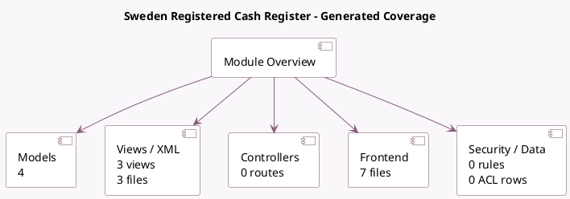

<!-- GENERATED:MODULE -->
---
tags: [odoo, enterprise, module]
---

# Sweden Registered Cash Register

- Scope: Enterprise Addons
- Source: enterprise/l10n_se_pos
- Dependencies: [[docs/Community Addons/pos_restaurant/pos_restaurant|pos_restaurant]], [[docs/Enterprise Addons/pos_iot/pos_iot|pos_iot]], [[docs/Community Addons/l10n_se/l10n_se|l10n_se]]

## Summary

Implements the registered cash system

## Generated coverage

- Models: 4
- XML files with UI/data artifacts: 3
- Views: 3
- Actions: 0
- Menus: 0
- Rules (ir.rule): 0
- Access CSV entries: 0
- Controller units: 0
- Frontend asset files: 7

## Module map

## Detail notes

- Models: [[docs/Enterprise Addons/l10n_se_pos/Models|Models]] (4)
- Views and XML: [[docs/Enterprise Addons/l10n_se_pos/Views|Views]] (3 files)
- Frontend: [[docs/Enterprise Addons/l10n_se_pos/Frontend|Frontend]] (7 files)

## Key models

- `pos.config`
- `pos.order`
- `product.product`
- `res.config.settings`

## Navigation

- [[../Enterprise Addons/Enterprise Addons|Back to scope]]
- [[../../docs/docs|Back to docs]]

<!-- GENERATED:MODULE -->

