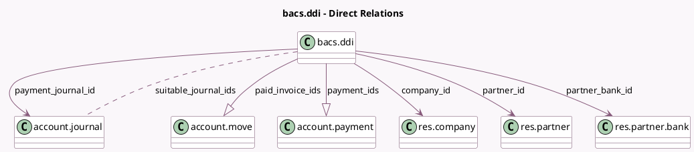

<!-- GENERATED:MODEL -->
---
tags: [odoo, enterprise, generated, model]
---

# bacs.ddi

- Module: [[docs/Enterprise Addons/l10n_uk_bacs/l10n_uk_bacs|l10n_uk_bacs]]
- Scope: Enterprise Addons
- Defined in module: yes
- Source files: `models/bacs_direct_debit_instruction.py`
- Python classes: `BacsDdi`
- Description: BACS Direct Debit Instruction
- Inherits: `mail.activity.mixin`, `mail.thread`

## Field footprint

- Detected fields: 12
- Field types: `Char` x 1, `Date` x 1, `Integer` x 2, `Many2many` x 1, `Many2one` x 4, `One2many` x 2, `Selection` x 1
- Relation fields: 7

## Sample fields

- `company_id`: `Many2one` (comodel `res.company`)
- `name`: `Char`
- `paid_invoice_ids`: `One2many` (comodel `account.move`, compute `_compute_from_moves`)
- `paid_invoices_len`: `Integer` (compute `_compute_from_moves`)
- `partner_bank_id`: `Many2one` (comodel `res.partner.bank`)
- `partner_id`: `Many2one` (comodel `res.partner`)
- `payment_ids`: `One2many` (comodel `account.payment`, compute `_compute_from_moves`)
- `payment_journal_id`: `Many2one` (comodel `account.journal`)
- `payments_len`: `Integer` (compute `_compute_from_moves`)
- `start_date`: `Date`
- `state`: `Selection`
- `suitable_journal_ids`: `Many2many` (comodel `account.journal`, compute `_compute_suitable_journal_ids`)

## Method hints

- Detected methods: 13
- Action methods: `action_cancel_draft_ddi`, `action_close_ddi`, `action_print_ddi`, `action_revoke_ddi`, `action_validate_ddi`, `action_view_paid_invoices`, `action_view_payments_to_collect`
- Compute methods: `_compute_from_moves`, `_compute_suitable_journal_ids`
- Onchange methods: none

## Direct relation diagram

## Navigation

- **Parent:** [[docs/Enterprise Addons/l10n_uk_bacs/Models]]

<!-- GENERATED:MODEL -->
