<!-- GENERATED:MODEL -->
---
tags: [odoo, enterprise, generated, model]
---

# l10n_uk.hmrc.transaction

- Module: [[docs/Enterprise Addons/l10n_uk_hmrc/l10n_uk_hmrc|l10n_uk_hmrc]]
- Scope: Enterprise Addons
- Defined in module: yes
- Source files: `models/hmrc_transaction.py`
- Python classes: `HMRCTransaction`
- Description: Contains a single transaction made to hmrc

## Field footprint

- Detected fields: 12
- Field types: `Binary` x 1, `Char` x 3, `Date` x 2, `Datetime` x 2, `Many2one` x 2, `Selection` x 2
- Relation fields: 2

## Sample fields

- `company_id`: `Many2one` (comodel `res.company`)
- `completed_datetime`: `Datetime`
- `correlation_id`: `Char`
- `next_endpoint`: `Char`
- `next_polling`: `Datetime`
- `period_end`: `Date`
- `period_start`: `Date`
- `response_file`: `Binary`
- `response_filename`: `Char`
- `sender_user_id`: `Many2one` (comodel `res.users`)
- `state`: `Selection`
- `transaction_type`: `Selection`

## Method hints

- Detected methods: 13
- Action methods: none
- Compute methods: none
- Onchange methods: none

## Direct relation diagram

```plantuml
@startuml
!define ODOO_COLOR_PRIMARY #714B67
!define ODOO_COLOR_ACCENT #875A7B
!define ODOO_COLOR_BG #FAF7FA

skinparam backgroundColor ODOO_COLOR_BG
skinparam defaultTextAlignment left
skinparam ArrowColor ODOO_COLOR_ACCENT
skinparam ClassBackgroundColor white
skinparam ClassBorderColor ODOO_COLOR_PRIMARY
skinparam ComponentBackgroundColor white
skinparam ComponentBorderColor ODOO_COLOR_PRIMARY
skinparam NoteBackgroundColor #FFF8FF
skinparam NoteBorderColor ODOO_COLOR_ACCENT
skinparam SequenceLifeLineBorderColor ODOO_COLOR_ACCENT
skinparam SequenceLifeLineBackgroundColor #FFFFFF
skinparam SequenceParticipantBorderColor ODOO_COLOR_PRIMARY
skinparam SequenceParticipantBackgroundColor #FFFFFF
skinparam sequence {
  ArrowColor ODOO_COLOR_ACCENT
  ActorBorderColor ODOO_COLOR_PRIMARY
}
title l10n_uk.hmrc.transaction - Direct Relations
class "l10n_uk.hmrc.transaction" as l10n_uk_hmrc_transaction
class "res.company" as res_company
class "res.users" as res_users
l10n_uk_hmrc_transaction --> res_users : sender_user_id
l10n_uk_hmrc_transaction --> res_company : company_id
@enduml
```

## Navigation

- **Parent:** [[docs/Enterprise Addons/l10n_uk_hmrc/Models]]

<!-- GENERATED:MODEL -->
